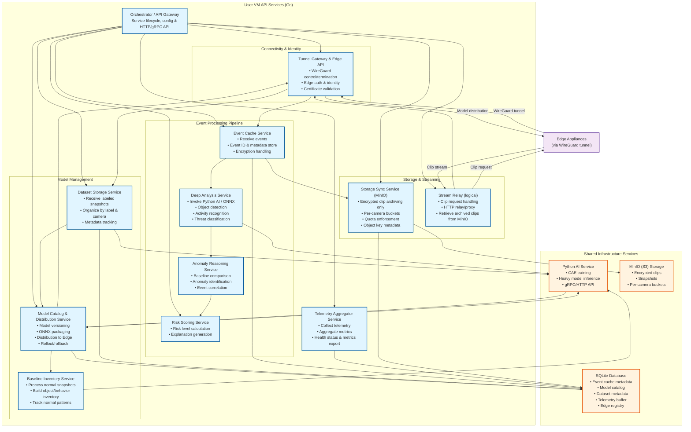

# Phase 2: User VM API Services

**Responsibility**: User VM API Services are the cloud-side (but still customer-owned) component of the anomaly / threat-detection pipeline. They run on the customer's dedicated VM (or as a Docker Compose stack for the PoC) and sit between Edge Appliances and the optional multi-tenant SaaS control plane. Their primary responsibilities are:

1. **Secure connectivity & identity**

   - Terminate WireGuard (or equivalent) tunnels from Edge Appliances.

   - Establish secure communication when an edge node connects for the first time.

   - Authenticate and authorize each Edge Appliance based on provisioned certificates/keys and registration metadata.

   - Manage per-edge identity, allowed cameras, and revocation.

2. **Ingest and manage labeled "normal scene" snapshots**

   - Receive labeled camera snapshots from edges that represent **normal** scene views under different conditions (day/night, lighting, weather, seasonal layout, etc.).

   - Store snapshots together with camera, time, and label metadata for later training, evaluation, and audit.

3. **Train and version lightweight edge models**

   - Train configured lightweight AI models (small enough for constrained edge hardware) on labeled snapshots to classify incoming frames as "normal" vs "anomaly/threat".

   - Maintain per-camera or per-profile model versions and metadata (training dataset, timestamps, basic performance metrics).

   - Optionally support both batch and incremental (online) retraining strategies.

4. **Distribute models to Edge Appliances**

   - Package and deliver trained lightweight models to the edge component over the secure tunnel.

   - Coordinate rollout and rollback of models, including compatibility checks (model format, minimal edge capabilities).

   - Track which edge node and which camera profile is running which model version.

5. **Build a baseline inventory of normal objects per camera**

   - Process labeled "normal scene" snapshots with a more powerful "big" model (e.g., general object detector / scene understanding model).

   - Maintain an inventory of normal object types, typical positions/layouts, and frequencies per camera view.

   - Expose this baseline inventory to downstream analysis for anomaly reasoning.

6. **Ingest event frames and encrypted event clips**

   - Receive "event" frames and short encrypted event clips from edges when their local model triggers (motion, anomaly, rule-based events, etc.).

   - Persist event metadata, including camera, timestamps, triggering model version, and pointers/IDs of encrypted clips in local/remote storage.

   - Ensure that only encrypted payloads are stored or forwarded; raw continuous video is never handled outside the edge.

7. **Deep event analysis with heavier models**

   - Run more powerful models on event frames and event clips (object detection, activity recognition, scene understanding, threat-type classification, etc.).

   - Enrich events with detected objects, attributes (person/vehicle/animal, direction, speed), and contextual tags (e.g., "loitering", "running", "object left behind").

8. **Baseline comparison & anomaly reasoning**

   - Compare "event" objects and patterns against the baseline inventory of normal objects and behaviors for each camera.

   - Identify anomaly types (e.g., new object, missing expected object, abnormal count, abnormal time-of-day, unusual path or dwell time).

   - Optionally group or correlate related events (bursts of similar events, repeated anomalies on the same camera or area).

9. **Risk scoring, reporting & API surface**

   - Generate an event report including:

     - Risk level / severity score

     - Detected objects and anomaly type

     - Short explanation of *why* the event is considered abnormal (key factors and evidence).

   - Expose APIs for:

     - Edge ↔ VM coordination (model lifecycle, event upload, acknowledgements).

     - UI / SaaS control plane ↔ VM (event listing, search, retrieval/streaming of encrypted clips, telemetry).

   - Provide basic observability and telemetry for model quality and system health (event volumes, risk distribution, feedback hooks for marking false positives / false negatives).


## Architecture

The User VM API Services architecture is organized into specialized **logical services** that implement the 9 core responsibilities. The system follows a service-oriented architecture pattern with clear separation of concerns. For the PoC, most logical services run inside a **single Go binary/container**, while Python AI, SQLite, and MinIO run as separate containers.

> **Implementation note (PoC)**: Although the diagram shows many logical services, the PoC runs them as **one Go binary / container** with internal modules:
>
> - `connectivity` (Tunnel Gateway + Edge API)
> - `events` (EventCache, DeepAnalysis, AnomalyReasoning, RiskScoring)
> - `models` (DatasetStorage, ModelCatalog, BaselineInventory)
> - `storage` (StorageSync, StreamRelay)
> - `telemetry` (TelemetryAgg)
>
> Python AI, SQLite, and MinIO remain separate containers in Docker Compose.

### Architecture Block Diagram



### Component Descriptions

**Core Go Services (logical modules, one binary for PoC):**

1. **Orchestrator / API Gateway**

   Main coordinator managing lifecycle, configuration, and HTTP/gRPC APIs for Edge and UI/SaaS.

2. **Tunnel Gateway & Edge API Service**

   Manages WireGuard interfaces and peers, terminates tunnels, authenticates and authorizes Edge Appliances, and exposes Edge-facing APIs over the tunnel.

3. **Event Cache Service**

   Receives events (frames, clips, metadata) from edge, assigns event IDs, stores event metadata, and manages encrypted payload references. Event IDs and metadata are the *source of truth* for the event timeline.

4. **Deep Analysis Service**

   Orchestrates deep analysis by invoking heavy models (via Python AI or ONNX Runtime) for object detection, activity recognition, and threat classification.

5. **Anomaly Reasoning Service**

   Compares event objects/patterns against baseline inventory to identify anomaly types and correlate related events.

6. **Risk Scoring Service**

   Computes risk scores and generates short, human-readable explanations of why an event is abnormal.

7. **Dataset Storage Service**

   Manages labeled snapshot ingestion and storage, organized by camera, label, and conditions, with metadata persisted in SQLite.

8. **Model Catalog & Distribution Service**

   Maintains model versions and metadata, packages models (ONNX), distributes them to Edge Appliances, and supports rollout/rollback.

9. **Baseline Inventory Service**

   Processes "normal scene" snapshots with big models (via Python AI) to build per-camera object/behavior inventories and normal patterns.

10. **Storage Sync Service**

    Archives encrypted clips and snapshots to MinIO, enforces per-camera quotas, and maintains object keys and bucket mappings in SQLite. Only persists **encrypted blobs**; stores **object keys + bucket info** in SQLite.

11. **Stream Relay (logical) Service**

    Handles on-demand clip retrieval requests from clients. Retrieves archived clips from MinIO (via Storage Sync Service) and serves them to clients. **Note**: Edge Web UI is on local home network only (unreachable from Internet). Edge does NOT stream to VM - Edge only sends event frames and short clips when events occur.

12. **Telemetry Aggregator Service**

    Collects telemetry from Edge and internal services, aggregates health metrics, persists them in SQLite, and exposes them in a metrics-friendly format (Prometheus/OpenTelemetry compatible for future production monitoring).

**Shared Infrastructure Services:**

- **Python AI Service**

  Separate Python service for both:

  * Training lightweight CAE models
  * Running heavy "big" models used by Deep Analysis and Baseline Inventory

    Exposes a simple gRPC/HTTP API.

- **SQLite Database**

  Local persistent store for events metadata, model catalog, dataset metadata, telemetry buffer, and Edge registry. Single-file DB simplifies backup & inspection.

- **MinIO (S3-compatible)**

  Object storage for encrypted clips and snapshots, using per-camera buckets or prefixes and server-side bucket policies.

### Data Flow

1. **Edge Connection**: Edge Appliance → Tunnel Gateway → Authentication → Identity Management
2. **Dataset Ingestion**: Edge → Dataset Storage → Organize by label & camera → SQLite metadata
3. **Model Training**: Dataset Storage → Python AI Service → Train CAE → Model Catalog → Distribution to Edge
4. **Baseline Building**: Dataset Storage → Baseline Inventory Service → Python AI Service (big model) → Normal object inventory
5. **Event Processing**: Edge → Event Cache (event frames + short clips) → Deep Analysis (Python AI) → Anomaly Reasoning → Risk Scoring → Report Generation
6. **Storage**: Event Cache → Storage Sync → MinIO (encrypted clips/snapshots) + SQLite (object keys)
7. **Clip Retrieval**: Client Request (Edge Web UI - local network only) → API Gateway → Stream Relay → Storage Sync → MinIO → Encrypted Clip → Client (decrypts locally) 

---

## Project Structure

The User VM API Services are **open source** and developed directly in the parent meta repository under the `user-vm-api/` directory. This aligns with the "trust us / verify us" privacy story - customers can audit all code that runs on their VM.

**Repository Location**: `user-vm-api/` (root level of meta repository)

```
user-vm-api/
├── cmd/
│   └── server/
│       └── main.go                    # Main entry point (orchestrator)
│
├── internal/
│   ├── orchestrator/                  # Main orchestrator service
│   │   ├── server.go                  # Service lifecycle management
│   │   ├── manager.go                 # Service manager pattern
│   │   └── health.go                  # Health checks
│   │
│   ├── tunnel-gateway/                # Tunnel Gateway & Edge API Service
│   │   ├── wireguard.go               # WireGuard server management
│   │   ├── edge_api.go                # Edge-facing gRPC/HTTP APIs
│   │   └── auth.go                    # Edge authentication & authorization
│   │
│   ├── event-cache/                   # Event Cache Service
│   │   ├── receiver.go                 # Event reception from Edge
│   │   ├── storage.go                  # Event metadata storage
│   │   └── cache.go                    # Cache management
│   │
│   ├── deep-analysis/                 # Deep Analysis Service
│   │   ├── orchestrator.go            # Orchestrates Python AI calls
│   │   ├── inference.go               # Inference coordination
│   │   └── client.go                  # Python AI Service client
│   │
│   ├── anomaly-reasoning/             # Anomaly Reasoning Service
│   │   ├── comparator.go              # Baseline comparison logic
│   │   ├── correlator.go              # Event correlation
│   │   └── classifier.go              # Anomaly type classification
│   │
│   ├── risk-scoring/                  # Risk Scoring Service
│   │   ├── scorer.go                  # Risk level calculation
│   │   └── explainer.go               # Explanation generation
│   │
│   ├── dataset-storage/               # Dataset Storage Service
│   │   ├── receiver.go                # Dataset reception from Edge
│   │   ├── organizer.go               # Organize by label & camera
│   │   └── storage.go                 # Filesystem storage management
│   │
│   ├── model-catalog/                 # Model Catalog & Distribution Service
│   │   ├── catalog.go                 # Model registry & versioning
│   │   ├── packager.go                # ONNX packaging
│   │   └── deployer.go                # Distribution to Edge
│   │
│   ├── baseline-inventory/            # Baseline Inventory Service
│   │   ├── processor.go               # Process normal snapshots
│   │   ├── builder.go                 # Build object/behavior inventory
│   │   └── tracker.go                # Track normal patterns
│   │
│   ├── storage-sync/                  # Storage Sync Service
│   │   ├── s3_client.go               # MinIO/S3 client (minio-go/v7)
│   │   ├── uploader.go                # Encrypted clip/snapshot upload
│   │   ├── retriever.go               # Clip/snapshot retrieval
│   │   └── quota.go                   # Quota management
│   │
│   ├── stream-relay/                  # Stream Relay Service (logical)
│   │   ├── handler.go                 # Request handling
│   │   └── proxy.go                   # HTTP relay/proxy
│   │
│   ├── telemetry-aggregator/          # Telemetry Aggregator Service
│   │   ├── collector.go               # Telemetry collection
│   │   ├── aggregator.go              # Metrics aggregation
│   │   └── exporter.go                # Prometheus/OpenTelemetry export
│   │
│   └── shared/                        # Shared libraries
│       ├── config/                     # Configuration management
│       ├── logging/                    # Structured logging
│       ├── database/                    # SQLite database layer
│       │   ├── db.go                   # Connection management
│       │   ├── schema.go               # Database schema
│       │   └── migrations/             # Database migrations
│       └── storage/                     # Filesystem storage utilities
│           ├── dataset_storage.go      # Dataset storage service
│           └── model_storage.go        # Model storage service
│
├── training-service/                   # Python AI Service (separate container)
│   ├── Dockerfile                      # Python 3.11+ with PyTorch/ONNX
│   ├── requirements.txt                # Python dependencies
│   ├── pyproject.toml                 # Python project config (optional)
│   ├── main.py                        # FastAPI service entry point
│   ├── models/
│   │   ├── autoencoder.py             # CAE model definition
│   │   └── base_models.py             # Pre-trained base models (YOLOv8)
│   ├── training/
│   │   ├── trainer.py                 # Training loop
│   │   ├── dataset.py                 # Dataset loader
│   │   └── metrics.py                 # Training metrics
│   ├── export/
│   │   ├── onnx_exporter.py           # Export to ONNX format
│   │   └── onnx_simplifier.py         # ONNX graph simplification (optional)
│   ├── inference/
│   │   ├── object_detector.py         # YOLOv8 inference
│   │   └── baseline_processor.py      # Baseline inventory processing
│   └── config/
│       └── training_config.yaml       # Training hyperparameters
│
├── config/
│   ├── config.yaml.example            # Example configuration file
│   └── config.yaml                    # Actual config (gitignored)
│
├── scripts/
│   ├── build.sh                       # Build script
│   └── migrate.sh                     # Database migration script
│
├── docker/
│   ├── Dockerfile                     # Go service Dockerfile
│   └── docker-compose.yml              # Local development stack
│
├── .github/
│   └── workflows/
│       └── user-vm-api.yml             # CI/CD pipeline
│
├── go.mod                              # Go module definition
├── go.sum                              # Go dependencies checksum
├── .gitignore                          # Git ignore patterns
├── README.md                           # Project documentation
└── Makefile                            # Build automation (optional)
```

**Key Points:**

- **Open Source**: All code in `user-vm-api/` is public and auditable
- **Single Binary**: All Go services compile into one binary (`cmd/server/main.go`)
- **Python Service**: Separate containerized service in `training-service/`
- **Shared Infrastructure**: SQLite DB and MinIO run as separate containers in Docker Compose
- **Modular Design**: Each logical service is a separate Go package under `internal/`
- **Shared Libraries**: Common utilities in `internal/shared/`

**Note**: gRPC proto definitions are in the parent repo at `proto/proto/edge/` (Edge ↔ User VM) and imported as Go module dependencies.

---

**Duration**: 1-2 weeks  
**Goal**: Build User VM API services in Go - WireGuard server, event cache (receives event frames/clips from Edge), clip retrieval service (archived clips from MinIO), MinIO integration (S3-compatible), AI model catalog, and secondary event analysis

**Note**: Duration estimate based on actual development velocity (Edge Phase 1 took ~2 days for ~88% completion). Phase 2 may be faster due to similar Go patterns and established architecture.

**PoC Scope**: User VM API runs as a **Docker Compose service** in the local development environment. For PoC:
- **No SaaS components** - Edge Appliance and User VM API communicate directly
- **No Management Server** - Direct Edge ↔ User VM API communication
- **MinIO instead of Filecoin** - Use MinIO (S3-compatible) for remote storage
- **Docker Compose integration** - User VM API and MinIO run as services alongside Edge Appliance

**Scope**: User VM API (open source) that runs in Docker Compose. The User VM API:
- Manages WireGuard tunnel termination for Edge Appliances
- Maintains AI model catalog (base models, customer-trained variants - basic for PoC)
- Receives event frames and short event clips from Edge (not streaming - Edge sends when events occur)
- Runs secondary analysis on event frames/clips (basic for PoC)
- Persists long-term events/clips in MinIO (S3-compatible storage)
- Clip retrieval service for archived clips from MinIO (Edge Web UI is local network only, unreachable from Internet)
- Event cache and telemetry aggregation

## Technical Stack & AI Models

### Core Stack (Go Services)

**Language & Runtime:**
- **Go 1.25+** (Golang)
  - Primary language for all User VM API services
  - **Single binary deployment**: all logical services run in one container for PoC
  - Excellent concurrency model for handling many concurrent Edge connections
  - Strong standard library for networking, crypto, and OS integration

**Key Libraries & Frameworks:**

- **HTTP / APIs**
  - `github.com/gin-gonic/gin` – HTTP web framework for API Gateway / UI integration
  - `google.golang.org/grpc` – gRPC for APIs (Edge ↔ User VM over WireGuard) - event frame/clip upload, model distribution, telemetry
  - `google.golang.org/protobuf` – Protocol Buffers (IDL + codegen)

- **Networking / Tunnels**
  - `golang.zx2c4.com/wireguard` – WireGuard tunnel management (peer config, keys, lifecycle)

- **Storage / S3**
  - `github.com/minio/minio-go/v7` – **Primary** MinIO / S3 client for clip/snapshot archiving
  - `github.com/aws/aws-sdk-go-v2` (optional) – For future direct AWS S3 or S3-IPFS/Filecoin bridge integration

- **Database**
  - SQLite via either:
    - `modernc.org/sqlite` – pure Go driver (no CGO, easier static builds), **recommended**
    - `github.com/mattn/go-sqlite3` – CGO driver (if needed for specific features/performance)
  - Used for: event metadata, model catalog, dataset metadata, telemetry buffer, Edge registry

- **Config / Logging / Telemetry**
  - `go.uber.org/zap` – structured logging
  - `github.com/spf13/viper` – configuration management (env vars + config files)
  - `github.com/prometheus/client_golang` (or OpenTelemetry SDK) – metrics export for health/monitoring

**Communication:**

- **Edge ↔ User VM API**
  - **gRPC** over **WireGuard** tunnel (mTLS inside VPN) for event frame/clip upload (Edge sends when events occur, not streaming), model distribution, telemetry
  - gRPC APIs for model download and event frame/clip upload

- **UI / SaaS ↔ User VM API**
  - **HTTP/REST + JSON** via API Gateway (Gin)
  - Authentication via API tokens or mTLS (per-tenant, per-VM)

- **Serialization**
  - **Protocol Buffers** for Edge ↔ User VM contracts
  - JSON for external-facing REST APIs

**Storage Layout:**

- **SQLite**
  - Single-file DB, stored on Docker volume or host path (e.g., `/var/lib/guardian/user-vm-api/uservm.db`)
  - Tables for: events, models, datasets, telemetry, Edge registry

- **Object Storage (S3-compatible)**
  - **PoC / Local Testing**: **MinIO** (S3-compatible)
    - Encrypted event clips and snapshots only (no raw continuous video)
    - Per-camera buckets or prefixes, e.g., `events/{camera_id}/{date}/event-{id}.mp4`
    - Client: `minio-go/v7` from Go services
  - **Production**: **S3-IPFS/Filecoin bridge** (post-PoC)
    - Encrypted clips archived to Filecoin/IPFS via S3-compatible bridge
    - CID (Content Identifier) storage in SQLite for retrieval
    - Same S3-compatible API, different backend storage

- **Local filesystem**
  - Dataset storage: `data/datasets/{dataset_id}/{label}/` (e.g., `normal`, `abnormal`)
  - Model storage: `data/models/{model_id}/` (ONNX + metadata JSON)
  - Log/metrics files (optional) under `data/logs/`

### Python AI Service Stack

**Language & Runtime:**
- **Python 3.11+** (3.13+ recommended, current: 3.13.7)
  - Separate containerized microservice for AI training and heavy model inference
  - Runs alongside User VM API and MinIO in Docker Compose

**Deep Learning Framework:**
- **PyTorch 2.9.x** (or latest stable)
  - Primary framework for training and heavy inference
  - Strong ecosystem and GPU support; CPU-only acceptable for PoC
  - Supports modern Python (3.11/3.12+) and actively maintained

**Key Libraries:**

- **Vision / Preprocessing**
  - `torchvision` – transforms, datasets, pre-trained backbones
  - `opencv-python` – image ops (resize, crop, blur, color transforms)
  - `Pillow` – image I/O and basic manipulation
  - `numpy` – numerical building block

- **Model Export / Inference**
  - `onnx` – export models from PyTorch
  - `onnxruntime` – validate ONNX export, optional CPU inference checks
  - `onnx-simplifier` (optional) – simplify ONNX graphs for edge/runtime compatibility

- **Service Layer**
  - **FastAPI** – async HTTP API for:
    - Training requests (start/monitor/stop job)
    - Inference calls (deep analysis, baseline processing)
  - `uvicorn` – ASGI server

- **Training Utilities (optional but recommended)**
  - `pytorch-lightning` or `lightning` – cleaner training loops, callbacks, checkpointing
  - `torchmetrics` – metric computation
  - `tensorboard` or `wandb` – experiment tracking (optional for PoC)

**Service Responsibilities:**

- Expose **simple HTTP/JSON API** to Go services:
  - `POST /train/cae` – start training CAE on a dataset ID
  - `POST /infer/object-detect` – run YOLO on an image/frame
  - `POST /infer/baseline` – extract object inventory from snapshot batch
  - `GET /train/{job_id}` – get training job status
  - `GET /train/{job_id}/metrics` – get training metrics
- Persist models and logs to shared filesystem (mounted volume) so Go side can package and distribute ONNX models

### AI Models

#### 1. Anomaly Detection Models (Customer-Trained)

**Architecture: Convolutional Autoencoder (CAE)**

- **Purpose**: Detect "unusual" frames relative to per-camera normal behavior
- **Training Data**: Only **normal** snapshots per camera (unsupervised / semi-supervised anomaly detection)
- **Input**:
  - RGB images
  - Resolution configurable per camera, e.g., `224×224` or `320×240`
- **Architecture (baseline PoC)**
  - Encoder: 3–4 conv blocks + pooling → latent vector `128–256` dims
  - Decoder: 3–4 transposed conv blocks → reconstruct input
  - Loss: Mean Squared Error (MSE); optional perceptual loss (e.g., VGG features) later
- **Inference Flow**
  - Reconstruct frame → compute reconstruction error
  - Per-camera threshold: high error ⇒ anomaly candidate
- **Model Size**
  - ~5–20 MB ONNX (edge-friendly)
- **Format & Runtime**
  - Trained in PyTorch → exported to **ONNX**
  - Edge inference via **ONNX Runtime** or **OpenVINO** (depending on edge hardware)

**Future / Alternative Architectures:**

- **VAE / β-VAE** – better uncertainty / density estimation
- **Patch-based AE** – local anomaly detection (e.g., unusual region within otherwise normal scene)
- **Memory-augmented AE** – improved modeling of normal patterns with explicit memory bank

---

#### 2. Object Detection Models (Pre-trained, Heavy Inference)

**Primary choice: YOLOv8 (Ultralytics)**

- **Purpose**
  - Baseline object inventory for each camera (normal objects, positions, frequencies)
  - Deep event analysis (objects present in anomaly events)
- **Variants (candidate hierarchy)**
  - `yolov8n` – smallest, fastest (for low-latency CPU)
  - `yolov8s` – balanced for PoC (likely default)
  - `yolov8m` – higher accuracy, slower
- **Usage**
  - Runs **inside Python AI Service** (User VM), not on Edge
  - Used by Baseline Inventory Service and Deep Analysis Service
- **Classes**
  - COCO-style: person, vehicle, animal, bag, etc.
  - Optional future fine-tuning for security-specific classes

**Alternatives / Future:**

- **YOLOv9 / newer Ultralytics models** – upgrade path when stable and beneficial
- **DETR / RT-DETR** – transformer-based detection for more complex scenes
- **Specialized models** – e.g., license plate, face blur (privacy), helmet/PPE detection

---

#### 3. Activity Recognition Models (Future)

(Deferred to post-PoC; object-level analysis is enough initially.)

- Candidate families:
  - **SlowFast**, **X3D** – efficient video action recognition
  - **TimeSformer** – transformer models for longer context
- Likely to run **only** in Python AI Service on selected event clips due to cost.

---

#### 4. Scene Understanding Models (Future)

(Also post-PoC; nice for UX and advanced rules.)

- **CLIP** – text/image joint embedding (e.g., "someone is in the garden at night" queries)
- **BLIP-2** or similar captioning models – generate human-readable event summaries

### Model Formats & Distribution

**Primary Format: ONNX**

- Canonical format for models that must run on Edge
- Exported from PyTorch and validated with `onnxruntime`
- Keeps User VM and Edge decoupled from training framework

**Metadata**

Each model directory contains an ONNX file plus a `metadata.json`, for example:

```json
{
  "model_id": "uuid",
  "version": "1.0.0",
  "camera_id": "camera-rtsp-192.168.1.100",
  "model_type": "cae",
  "input_shape": [224, 224, 3],
  "latent_dim": 128,
  "threshold": 0.05,
  "training_dataset_id": "uuid",
  "training_date": "2025-11-25T00:00:00Z",
  "framework": "pytorch",
  "onnx_file": "model.onnx",
  "preprocessing": {
    "resize": [224, 224],
    "normalize_mean": [0.485, 0.456, 0.406],
    "normalize_std": [0.229, 0.224, 0.225]
  }
}
```

This metadata is ingested into the **Model Catalog** so the User VM API knows:

* Which model is deployed on which camera
* What thresholds and preprocessing to apply
* Which dataset and training run produced it

**Distribution Workflow**

* Python AI Service writes model files + metadata to shared storage path
* Go **Model Catalog** service:
  * Validates presence of `model.onnx` + `metadata.json`
  * Registers new model version in SQLite
  * Pushes model to Edge via gRPC streaming over WireGuard
* Edge stores models under e.g., `{data_dir}/models/{model_id}/model.onnx` and updates runtime.

---

### Infrastructure Services

**MinIO (S3-compatible Storage)**

* **Purpose**: Store encrypted event clips and snapshots; never raw continuous video
* **Usage**: **PoC / Local Testing** only
* **Backend**: Latest MinIO Community Edition, built from source into a Docker image
* **Layout**:
  * Per-camera buckets or prefixes (whichever is simpler operationally)
  * Server-side policies to restrict access per User VM
* **Client**: `minio-go/v7` from Go services; standard S3 SDKs usable for external integration later
* **Production**: Post-PoC, will migrate to **S3-IPFS/Filecoin bridge** for decentralized storage

**SQLite Database**

* **Engine**: SQLite 3.x (e.g., 3.51.0+)
* **Location**: Single DB file on persistent volume (e.g., `/var/lib/guardian/user-vm-api/uservm.db`)
* **Usage**:
  * Event catalog and indices
  * Model registry and deployment state
  * Dataset metadata (camera, label, conditions)
  * Telemetry buffer and health metrics
  * CID storage (for Filecoin/IPFS post-PoC)

**Docker Compose Topology (PoC)**

* `user-vm-api` – Go binary with all logical services
* `python-ai-service` – Python FastAPI + PyTorch service
* `minio` – MinIO object storage (single node) with a bound data volume
* Shared volumes:
  * `user-vm-api-data` – SQLite DB, datasets, model artifacts
  * `minio-data` – S3 bucket data

### Development & Deployment

**Build & Packaging**

* **Go**
  * Standard `go build` (optionally with `CGO_ENABLED=0` when using pure-Go SQLite)
  * Multi-stage Dockerfile for small final image
  * Go `embed` package for static assets (if needed)

* **Python**
  * `requirements.txt` or `pyproject.toml` for dependencies
  * Docker image with pinned CUDA base (if GPU) or slim base image (CPU-only)

**CI/CD (directional, not PoC-critical)**

* GitHub Actions (or similar) for:
  * Running Go/Python unit tests + lint
  * Building and pushing Docker images to a container registry
* Versioned tags (e.g., `user-vm-api:v0.1.0`, `python-ai-service:v0.1.0`) matching metadata in `model_id` / `version` fields

**Local Development**

* **Docker Compose** to spin up full stack (User VM API, Python AI, MinIO)
* **Go dev**:
  * Hot reload with `air` / `reflex` (optional)
  * Local config profiles for dev vs PoC demo
* **Python dev**:
  * Virtualenv or container-based dev
  * Jupyter notebook support (optional) for experimenting with training recipes

---


**Critical Design Decision**: Before implementing Phase 2, we must design the anomaly detection model training pipeline. This affects:
- Model architecture selection (what type of models to train)
- Python training service design (how to train models on user snapshots)
- Model packaging and distribution (how models are sent to Edge)
- Edge inference integration (how Edge uses trained models)

### 2.0.1: Model Architecture Design

**Problem**: We need models that can distinguish "normal" vs "unusual" situations from camera snapshots, not just object detection. This requires **anomaly detection** models, not classification models.

**Model Architecture Options**:

1. **Autoencoder-based Anomaly Detection** (Recommended for PoC):
   - **Architecture**: Convolutional Autoencoder (CAE)
   - **Training**: Train on "normal" labeled snapshots only
   - **Inference**: Reconstruct input frame → Calculate reconstruction error → High error = anomaly
   - **Advantages**: 
     - Only needs "normal" examples (no need for "threat" examples during training)
     - Works well for scene-level anomalies (blocked camera, unusual objects, etc.)
     - Can be trained per-camera for camera-specific normal scenes
   - **Output Format**: ONNX or OpenVINO IR (for Edge inference)
   - **Model Size**: ~5-20 MB (suitable for Edge deployment)

2. **Variational Autoencoder (VAE)** (Alternative):
   - Similar to autoencoder but with probabilistic encoding
   - Better uncertainty estimation
   - Slightly more complex

3. **One-Class SVM / Isolation Forest** (Not recommended):
   - Traditional ML, not deep learning
   - Requires feature extraction (less flexible)
   - Harder to deploy on Edge

**Selected Architecture for PoC**: **Convolutional Autoencoder (CAE)**

**Model Specifications**:
- **Input**: RGB image (e.g., 224x224 or 320x240, configurable per camera)
- **Encoder**: 3-4 convolutional layers + pooling (reduces to latent space)
- **Decoder**: 3-4 transposed convolutional layers (reconstructs image)
- **Latent Space**: 128-256 dimensions (compressed representation)
- **Loss Function**: Mean Squared Error (MSE) or Perceptual Loss
- **Output**: Reconstruction error (scalar) + reconstructed image (for visualization)
- **Threshold**: Configurable per-camera (default: 0.05 reconstruction error)

**Training Data Requirements**:
- **Minimum**: 50-100 "normal" labeled snapshots per camera
- **Recommended**: 200-500 "normal" snapshots per camera
- **Format**: JPEG images, organized by label (`normal/`, `threat/`, `abnormal/`)
- **Preprocessing**: Resize to model input size, normalize pixel values

### 2.0.2: Python Training Service Design

**Component**: `user-vm-api/training-service/` (Python service, separate from Go services)

**Architecture**:
```
user-vm-api/
├── training-service/          # Python training service
│   ├── Dockerfile            # Python 3.11+ with PyTorch/ONNX
│   ├── requirements.txt      # PyTorch, torchvision, onnx, opencv-python, etc.
│   ├── main.py              # Training service entry point (HTTP/gRPC server)
│   ├── models/
│   │   ├── autoencoder.py   # CAE model definition
│   │   └── base_models.py   # Pre-trained base models
│   ├── training/
│   │   ├── trainer.py       # Training loop
│   │   ├── dataset.py       # Dataset loader (from dataset storage)
│   │   └── metrics.py       # Training metrics (loss, validation error)
│   ├── export/
│   │   ├── onnx_exporter.py # Export to ONNX format
│   │   └── openvino_exporter.py # Export to OpenVINO IR (optional)
│   └── config/
│       └── training_config.yaml # Training hyperparameters
```

**Training Service API** (HTTP REST or gRPC):
- `POST /train` - Start training job
  - Input: `{dataset_id, camera_id, model_config, hyperparameters}`
  - Output: `{job_id, status}`
- `GET /train/{job_id}` - Get training job status
  - Output: `{status, progress, metrics, model_path}`
- `GET /train/{job_id}/metrics` - Get training metrics
  - Output: `{epoch, loss, validation_error, learning_rate}`

**Training Workflow**:
1. User VM API (Go) receives dataset export from Edge
2. User VM API stores dataset in `datasets/{dataset_id}/{label}/`
3. User VM API creates training job, calls Python training service
4. Python service:
   - Loads "normal" images from `datasets/{dataset_id}/normal/`
   - Trains CAE model on normal images
   - Validates on held-out normal images
   - Exports trained model to ONNX format
   - Saves model to `models/{model_id}/model.onnx`
5. User VM API updates model catalog, distributes to Edge

**Training Hyperparameters** (Configurable):
- Learning rate: 0.001 (Adam optimizer)
- Batch size: 16-32 (depending on GPU memory)
- Epochs: 50-100 (early stopping if validation loss plateaus)
- Image size: 224x224 or 320x240 (per camera)
- Latent dimension: 128-256
- Loss function: MSE or Perceptual Loss

### 2.0.3: Model Packaging & Distribution

**Model Format**: ONNX (Open Neural Network Exchange)
- **Why ONNX**: 
  - Standard format, works with OpenVINO (Edge inference)
  - Can be converted to OpenVINO IR on Edge if needed
  - Smaller file size than PyTorch checkpoints
- **Model Metadata**:
  - Model version, training date, dataset ID
  - Input/output shapes, normalization parameters
  - Anomaly threshold (reconstruction error threshold)
  - Camera ID (if per-camera model)

**Distribution Flow**:
1. Python training service exports model to `models/{model_id}/model.onnx`
2. User VM API (Go) packages model + metadata:
   - Model file: `model.onnx`
   - Metadata: `metadata.json` (version, threshold, camera_id, etc.)
3. User VM API pushes to Edge via WireGuard (gRPC):
   - Stream model file over gRPC
   - Edge stores in `{data_dir}/models/{model_id}/model.onnx`
   - Edge updates model registry
4. Edge AI service loads model for inference

### 2.0.4: Edge Inference Integration

**Edge AI Service** (Python, existing):
- **Current**: Basic brightness-based anomaly detection
- **New**: Load trained CAE models from User VM
- **Inference Flow**:
  1. Receive frame from camera
  2. Preprocess: Resize to model input size, normalize
  3. Run CAE inference: `reconstructed = model.encode_decode(frame)`
  4. Calculate reconstruction error: `error = mse(frame, reconstructed)`
  5. Compare to threshold: `if error > threshold: trigger_event()`
  6. If anomaly: Capture snapshot, record clip, enqueue event

**Model Loading**:
- Edge AI service monitors `{data_dir}/models/` directory
- On new model file: Load ONNX model (using ONNX Runtime or OpenVINO)
- Per-camera model assignment: Each camera can have its own trained model
- Model versioning: Edge keeps previous model until new one is validated

**Inference Performance**:
- Target: <100ms per frame (10 FPS minimum)
- Hardware: CPU (Intel N100) or iGPU (Intel QSV) if available
- Optimization: OpenVINO IR format (faster than ONNX Runtime on Intel)

### 2.0.5: Training Pipeline Integration Points

**User VM API (Go) ↔ Python Training Service**:
- **Communication**: HTTP REST API (simple) or gRPC (more efficient)
- **Job Management**: User VM API tracks training jobs in SQLite
- **File Access**: Python service reads from `datasets/{dataset_id}/` (shared filesystem)
- **Model Storage**: Python service writes to `models/{model_id}/` (shared filesystem)

**Docker Compose Setup**:
```yaml
services:
  user-vm-api:
    # Go services
    ...
  
  training-service:
    build: ./training-service
    volumes:
      - ./data/datasets:/app/datasets  # Shared dataset storage
      - ./data/models:/app/models      # Shared model storage
    environment:
      - TRAINING_DATA_DIR=/app/datasets
      - MODEL_OUTPUT_DIR=/app/models
    ports:
      - "8082:8080"  # Training service API
```

**Training Service Dependencies**:
- Python 3.11+ (3.13+ recommended)
- PyTorch 2.0+ (or TensorFlow if preferred)
- ONNX / onnxruntime
- OpenCV (image preprocessing)
- NumPy, PIL/Pillow

---

**Next Steps**: This design should be implemented in Epic 2.8 (AI Model Orchestrator & Training Pipeline) with the following structure:
- Step 2.8.1: Model Catalog Management (Go)
- Step 2.8.2: Dataset Ingestion & Training Pipeline (Go + Python service)
- Step 2.8.3: Model Distribution to Edge (Go)
- Step 2.8.4: Python Training Service Implementation (NEW)
- Step 2.8.5: Edge Inference Integration (Python AI service update)

**Note**: Edge still performs first-level capture/recording, but User VM API handles event caching (receives event frames/clips from Edge), clip retrieval (archived clips from MinIO), and remote archival to MinIO over the secure WireGuard channel. **Edge Web UI is on local home network only (unreachable from Internet)**.

**Note**: Milestone 1 (first full event flow) will be achieved at the end of Phase 2, after User VM API is integrated with Edge Appliance.

---

## Epic 2.1: User VM API Project Setup

**Priority: P0**

### Step 2.1.1: Project Structure
- **Substep 2.1.1.1**: Create User VM API directory structure
  - **Status**: ✅ DONE
  - Note: User VM API is public/open source (developed directly in meta repo, secrets in memory only)
  - `user-vm-api/` - Main API services (root level of meta repository)
  - `user-vm-api/cmd/server/` - Main server entry point (orchestrator + API gateway)
  - `user-vm-api/internal/orchestrator/` - Main orchestrator service
  - `user-vm-api/internal/tunnel-gateway/` - Tunnel Gateway & Edge API Service
  - `user-vm-api/internal/event-cache/` - Event Cache Service
  - `user-vm-api/internal/deep-analysis/` - Deep Analysis Service
  - `user-vm-api/internal/anomaly-reasoning/` - Anomaly Reasoning Service
  - `user-vm-api/internal/risk-scoring/` - Risk Scoring Service
  - `user-vm-api/internal/dataset-storage/` - Dataset Storage Service
  - `user-vm-api/internal/model-catalog/` - Model Catalog & Distribution Service
  - `user-vm-api/internal/baseline-inventory/` - Baseline Inventory Service
  - `user-vm-api/internal/storage-sync/` - Storage Sync Service (MinIO/S3 for PoC, S3-IPFS/Filecoin bridge post-PoC)
  - `user-vm-api/internal/stream-relay/` - Stream Relay Service (logical)
  - `user-vm-api/internal/telemetry-aggregator/` - Telemetry Aggregator Service
  - `user-vm-api/internal/shared/` - Shared libraries (config, logging, database, storage)
  - `user-vm-api/training-service/` - Python AI Service (separate container)
  - `user-vm-api/config/` - Configuration files
  - `user-vm-api/scripts/` - Build and deployment scripts
  - `user-vm-api/docker/` - Dockerfiles and docker-compose.yml
  - Note: gRPC proto definitions are in meta repo `proto/` (Edge ↔ User VM and future SaaS ↔ User VM), imported as Go module dependencies
- **Substep 2.1.1.2**: Go modules setup
  - **Status**: ✅ DONE
  - Initialize Go modules (`go.mod`, `go.sum`)
  - Import `proto/go` from meta repo as Go module dependency
  - Import `crypto/go` from meta repo (if needed for encryption verification)
  - Dependency management (WireGuard, gRPC, SQLite, etc.)
  - Shared libraries structure
  - Location: `user-vm-api/go.mod`
- **Substep 2.1.1.3**: Set up CI/CD basics
  - **Status**: ✅ DONE
  - GitHub Actions for User VM API (in meta repo)
  - Docker image builds for Go service
  - Linting and basic tests
  - Location: `.github/workflows/user-vm-api.yml`

### Step 2.1.2: Local Development Environment
- **Substep 2.1.2.1**: Development tooling setup
  - **Status**: ✅ DONE
  - Install Go 1.25+ (as per TECHNICAL_STACK.md)
  - Set up code formatters (gofmt, goimports)
  - Configure linters (golangci-lint)
  - Set up pre-commit hooks
- **Substep 2.1.2.2**: Local testing environment
  - **Status**: ✅ DONE
  - Single `infra/local/docker-compose.yml` now orchestrates the entire PoC stack (Edge + User VM)
    - Added WireGuard automation: `wg-setup` sidecar generates keys inside Docker and shares them via `infra/local/wg`
    - Edge and User VM containers mount generated configs via volumes; both images now include `wireguard-tools`, `iproute2`, and supporting utilities
    - User VM API (Go) + MinIO + Python AI service remain as separate services with shared volumes for datasets/models (`user-vm-data`, `user-vm-datasets`, `user-vm-models`, etc.)
    - Edge orchestrator and edge AI services run in the same compose stack for end-to-end testing
  - Added `infra/local/start-local-env.sh` helper that:
    1. Runs `wg-setup` (Docker) to generate WireGuard key material under `infra/local/wg/keys`
    2. Runs `wg/generate-configs.sh` to materialize server/edge configs under `infra/local/wg/config`
    3. Brings the stack up (`docker compose up -d`) or handles restart/stop flows
  - WireGuard tunnel now auto-establishes on `start-local-env.sh start` with no manual steps: edge client and server use `ip` + `wg set` commands to configure interfaces, assign `10.0.0.1/24` ↔ `10.0.0.2/24`, and verify connectivity (`ping` succeeds both ways)
  - Local SQLite database persists via `user-vm-data` volume; MinIO data persists via `minio-data`
- **Substep 2.1.2.3**: IDE configuration
  - **Status**: ✅ DONE
  - VS Code / Cursor workspace settings
  - Debugging configurations for Go
  - Code snippets

### Step 2.1.3: Database & Storage Setup
- **Substep 2.1.3.1**: SQLite schema design
  - **Status**: ✅ DONE
  - Event cache table (event_id, edge_id, camera_id, timestamp, event_type, metadata, snapshot_path, clip_path, analyzed, severity, created_at, updated_at)
  - Edge Appliance registry (edge_id, name, wireguard_public_key, last_seen, status, created_at, updated_at)
  - AI model catalog (model_id, name, version, type, base_model, training_dataset_id, model_file_path, status, created_at, updated_at)
  - Training datasets (dataset_id, name, edge_id, dataset_dir_path, label_counts, total_images, status, created_at, updated_at)
  - CID storage table (cid_id, event_id, clip_path, cid, storage_provider, size_bytes, uploaded_at, retention_until)
  - Telemetry buffer table (telemetry_id, edge_id, timestamp, metrics_json, forwarded, created_at)
  - Location: `internal/shared/database/schema.go`
- **Substep 2.1.3.2**: Database migration system
  - **Status**: ✅ DONE
  - Migration tool setup (golang-migrate or custom)
  - Initial migrations (create all tables)
  - Migration rollback support
  - Migration versioning
  - Location: `internal/shared/database/migrations/`
- **Substep 2.1.3.3**: Database connection management
  - **Status**: ✅ DONE
  - SQLite connection pool setup
  - Connection health checks
  - Database initialization
  - Location: `internal/shared/database/db.go`
- **Substep 2.1.3.4**: File storage system for training datasets
  - **Status**: ✅ DONE
  - **P0**: Create dataset storage directory structure:
    - Base directory: `{data_dir}/datasets/`
    - Per-dataset structure: `datasets/{dataset_id}/`
    - Label-based subdirectories: `datasets/{dataset_id}/{label}/` (e.g., `normal/`, `threat/`, `abnormal/`, `custom/`)
    - Image files stored in label subdirectories: `datasets/{dataset_id}/{label}/image_{id}.jpg`
  - **P0**: Dataset storage service:
    - Create dataset directory structure
    - Store received snapshot images from Edge exports
    - Organize images by label
    - Track dataset size and file counts
    - Dataset cleanup and deletion
  - **P0**: Storage quota management:
    - Per-dataset size limits
    - Total storage quota for all datasets
    - Automatic cleanup of old datasets
  - **P0**: Dataset export/import:
    - Export dataset as ZIP archive (for training service)
    - Import dataset from Edge export (ZIP or directory)
    - Validate dataset structure and images
  - **P1**: Dataset versioning:
    - Track dataset versions
    - Support dataset snapshots
  - Location: `internal/shared/storage/datasets.go` (generic dataset storage helpers)
- **Substep 2.1.3.5**: Model file storage
  - **Status**: ✅ DONE
  - **P0**: Create model storage directory structure:
    - Base directory: `{data_dir}/models/`
    - Per-model structure: `models/{model_id}/`
    - Model files: `models/{model_id}/model.onnx`
    - Model metadata: `models/{model_id}/metadata.json`
  - **P0**: Model storage service (generic helpers):
    - Store trained model files
    - Track model versions
    - Model file retrieval for distribution to Edge
    - Model cleanup and deletion
  - **P0**: Storage quota management:
    - Per-model size limits
    - Total storage quota for all models
  - Location: `internal/shared/storage/models.go` (generic model storage helpers)
- **Substep 2.1.3.6**: Unit tests for User VM API project setup
  - **Status**: ✅ DONE
  - **P0**: Test database schema initialization
  - **P0**: Test database migration system
  - **P0**: Test database connection management
  - **P0**: Test dataset storage service (directory creation, image storage, organization by label)
  - **P0**: Test dataset export/import
  - **P0**: Test model storage service (model file storage, versioning)
  - **P0**: Test storage quota management
  - **P0**: Test Go module dependencies
  - **P1**: Test CI/CD pipeline
  - Location: `internal/shared/database/db_test.go`, `internal/shared/database/migrations/migrations_test.go`, `internal/shared/storage/datasets_test.go`, `internal/shared/storage/models_test.go`

---

## Epic 2.2: Tunnel Gateway & Edge API Service

**Priority: P0**

**Note**: This service combines WireGuard server management with Edge-facing APIs. It handles tunnel termination, authentication, and exposes gRPC/HTTP APIs for Edge communication.

### Step 2.2.1: WireGuard Server Implementation
- **Substep 2.2.1.1**: WireGuard server management
  - **Status**: ✅ DONE
  - **P0**: Go service using `golang.zx2c4.com/wireguard`
  - **P0**: Server configuration management
  - **P0**: Server key management
  - **P0**: WireGuard interface and peer management
  - Location: `internal/tunnel-gateway/wireguard.go`
- **Substep 2.2.1.2**: Edge Appliance management
  - **Status**: ✅ DONE
  - **P0**: Client key generation
  - **P0**: Client configuration generation
  - **P0**: Client registration and storage (SQLite Edge registry)
  - **P0**: Edge Appliance identity management
  - Location: `internal/tunnel-gateway/auth.go`
- **Substep 2.2.1.3**: Bootstrap process
  - **Status**: ✅ DONE
  - **P0**: Bootstrap token validation
  - **P0**: Initial client registration
  - **P0**: Long-lived credential issuance
  - **P0**: Certificate validation for Edge connections
  - Location: `internal/tunnel-gateway/auth.go`

### Step 2.2.2: Edge API Implementation
- **Substep 2.2.2.1**: Edge-facing gRPC API
  - **Status**: ✅ DONE
  - **P0**: gRPC server setup for Edge connections over WireGuard tunnel
  - **P0**: Event upload endpoints (receive events from Edge)
  - **P0**: Model distribution endpoints (push models to Edge) - Interface defined, implementation pending service integration
  - **P0**: Telemetry reception endpoints
  - **P0**: Dataset upload endpoints (receive labeled snapshots) - Interface defined, implementation pending service integration
  - Location: `internal/tunnel-gateway/edge_api.go`
  - **Notes**: Implemented gRPC server with authentication interceptor using WireGuard peer identification. Event and telemetry endpoints fully functional. Model distribution and dataset upload interfaces defined for future service integration.
- **Substep 2.2.2.2**: Connection monitoring
  - **Status**: ✅ DONE
  - **P0**: Track connected Edge Appliances
  - **P0**: Connection state management
  - **P0**: Disconnection detection and handling
  - **P0**: Tunnel health monitoring (ping/pong, latency tracking)
  - Location: `internal/tunnel-gateway/wireguard.go`
  - **Notes**: Enhanced PeerInfo with latency tracking, ping/pong counters, and transfer statistics. Added connection monitoring methods: GetPeerInfo, GetConnectedPeers, GetPeerLatency, UpdatePeerLatency, RecordPing. Automatic disconnection detection based on heartbeat timeout (5 minutes).
- **Substep 2.2.2.3**: Unit tests for Tunnel Gateway service
  - **Status**: ✅ DONE
  - **P0**: Test WireGuard server initialization and configuration
  - **P0**: Test Edge authentication and authorization
  - **P0**: Test Edge-facing gRPC API endpoints
  - **P0**: Test connection monitoring and state management
  - **P1**: Test tunnel health monitoring (ping/pong, latency, bandwidth)
  - Location: `internal/tunnel-gateway/*_test.go`
  - **Notes**: Comprehensive test suite covering server lifecycle, event upload (single and batch), telemetry/heartbeat handling, connection tracking, disconnection detection, and WireGuard connection monitoring features.

---

## Epic 2.2.1: Post-WireGuard Edge ↔ VM Coordination

**Priority: P0**

Once the WireGuard tunnel stands up automatically, the VM must immediately capture the edge’s camera inventory and dataset readiness, then guide the user toward collecting labeled snapshots where needed.

### Step 2.2.1.1: Capability Sync RPC
- **Substep 2.2.1.1.1**: Proto & RPC definitions
  - **Status**: ✅ DONE
  - Extended `proto/proto/edge/control.proto` with `CameraCapability`, `SyncCapabilitiesRequest`, `SyncCapabilitiesResponse`.
  - Added `SyncCapabilities` gRPC method to `ControlService` (Edge calls VM to report capabilities).
  - Location: `proto/proto/edge/control.proto`, `proto/go/generated/edge/control.pb.go`
- **Substep 2.2.1.1.2**: VM-triggered sync after WG handshake
  - **Status**: ✅ DONE
  - VM WireGuard server detects `latest_handshake` events from WireGuard peers and publishes connection events.
  - VM EdgeAPIServer receives `SyncCapabilities` calls from Edge and persists camera metadata, snapshot counts, and readiness flags in SQLite (`edge_camera_status` table via `CapabilityStore`).
  - Edge SyncService schedules periodic re-sync every 5 minutes to catch new cameras or additional labeled data.
  - Edge SyncService also triggers immediate sync when WireGuard connection is established (listens to `EventTypeWireGuardConnected` events).
  - Location: `user-vm-api/internal/tunnel-gateway/wireguard.go`, `user-vm-api/internal/tunnel-gateway/edge_api.go`, `user-vm-api/internal/tunnel-gateway/capability_store.go`, `edge/orchestrator/internal/capabilities/sync_service.go`
- **Substep 2.2.1.1.3**: Edge handler implementation
  - **Status**: ✅ DONE
  - Edge orchestrator's `SyncService` gathers discovery data (RTSP/USB inventory via `CameraManager`) plus labeled-snapshot counts per camera (via `ScreenshotService`).
  - Responds with `snapshot_required=true` when a camera lacks the minimum number of labeled "normal" snapshots (configurable via `MinNormalSnapshots`, default 50).
  - Location: `edge/orchestrator/internal/capabilities/sync_service.go`

### Step 2.2.1.2: VM-side Dataset Tracking
- **Substep 2.2.1.2.1**: Database extensions
  - **Status**: ✅ DONE
  - Extended `edge_camera_status` table with `training_eligibility_status` field to track camera readiness states (`needs_snapshots`, `ready_for_training`, `training_in_progress`).
  - Added helper methods to `CapabilityStore`: `GetCameraStatus`, `ListCamerasReadyForTraining`, `ListCamerasNeedingSnapshots`, `SetTrainingInProgress`.
  - These helpers allow Dataset Storage / Model Catalog services to query readiness state.
  - Location: `user-vm-api/internal/shared/database/schema.go`, `user-vm-api/internal/tunnel-gateway/capability_store.go`
- **Substep 2.2.1.2.2**: Event bus notifications
  - **Status**: ✅ DONE
  - Enhanced `CapabilityStore.UpsertCapabilities` to detect state transitions when camera training eligibility changes.
  - Publishes events: `camera.ready_for_training`, `camera.training_started`, `camera.needs_snapshots` when cameras transition between states.
  - Event bus integration: `CapabilityStore` receives event bus via `SetEventBus` and publishes transition events automatically.
  - Consumers (e.g., training scheduler) can subscribe to these events to react automatically.
  - Location: `user-vm-api/internal/tunnel-gateway/capability_store.go`
- **Substep 2.2.1.2.3**: API exposure
  - **Status**: ✅ DONE
  - Created `APIServer` in `user-vm-api/internal/orchestrator/api.go` with HTTP REST endpoints.
  - `GET /api/cameras` - Lists all cameras with their readiness status (supports `edge_id` query parameter).
  - `GET /api/cameras/{id}/dataset` - Returns detailed dataset status for a specific camera.
  - API Gateway integrated into orchestrator server and registered as a service.
  - Added `APIGatewayConfig` to configuration for enabling/disabling and port configuration.
  - Location: `user-vm-api/internal/orchestrator/api.go`, `user-vm-api/internal/orchestrator/server.go`, `user-vm-api/internal/shared/config/config.go`

### Step 2.2.1.3: Edge UI Guidance
- **Substep 2.2.1.3.1**: Notification surfacing
  - **Status**: ✅ DONE
  - Enhanced Edge UI Screenshots page with prominent notification banners showing cameras needing snapshots.
  - Added badges ("⚠️ Action Required") and progress bars for each camera requiring snapshots.
  - Each camera card shows: current/required snapshot counts, progress bar, remaining snapshots needed.
  - Added "Capture Now" CTA button that selects the camera, sets label to "normal", and triggers capture.
  - Added "Dismiss" button to acknowledge reminders.
  - Location: `edge/orchestrator/internal/web/frontend/src/pages/Screenshots.tsx`
- **Substep 2.2.1.3.2**: Progress display
  - **Status**: ✅ DONE
  - Enhanced Screenshots page with per-camera dataset progress display in the capture section.
  - Enhanced Cameras page (single view) with detailed dataset progress showing:
    - Collected vs. required snapshot counts with progress bar
    - Label coverage (number of different labels)
    - Dataset health status (Ready/In Progress)
    - CTA to navigate to Screenshots page if more snapshots needed
  - Added dataset status cards in Cameras page grid view showing progress badges for all cameras.
  - Progress bars use color coding: green for ready, yellow/blue for in progress.
  - Location: `edge/orchestrator/internal/web/frontend/src/pages/Screenshots.tsx`, `edge/orchestrator/internal/web/frontend/src/pages/Cameras.tsx`
- **Substep 2.2.1.3.3**: Reminder telemetry
  - **Status**: ✅ DONE
  - Added `POST /api/telemetry/reminder` endpoint to handle reminder acknowledgments and completions.
  - Edge UI sends telemetry when reminders are acknowledged ("dismiss") or completed ("capture now").
  - Telemetry includes: camera_id, action (acknowledged/completed), timestamp.
  - Edge logs reminder interactions for ops visibility (currently logged locally; can be extended to forward to VM via telemetry collector).
  - Location: `edge/orchestrator/internal/web/handlers.go` (handleReminderTelemetry), `edge/orchestrator/internal/web/frontend/src/pages/Screenshots.tsx` (acknowledgeReminder, completeReminder)

---

## Epic 2.3: Event Cache Service

**Priority: P0**

**Note**: Event Cache Service receives events from Edge via Tunnel Gateway, assigns event IDs, stores event metadata in SQLite, and manages encrypted payload references. **Edge sends event frames and short event clips (not streaming)** when events occur. Event IDs and metadata are the *source of truth* for the event timeline.

### Step 2.3.1: Event Reception & Storage
- **Substep 2.3.1.1**: Event reception from Edge
  - **Status**: ⬜ TODO
  - **P0**: Receive event frames and short event clips from Edge via Tunnel Gateway (gRPC over WireGuard tunnel)
  - **P0**: Note: Edge sends event frames and clips when events occur (not continuous streaming)
  - **P0**: Validate event structure
  - **P0**: Assign event IDs (UUID)
  - **P0**: Store event metadata in SQLite (event_id, edge_id, camera_id, timestamp, event_type, metadata, snapshot_path, clip_path, analyzed, severity, created_at, updated_at)
  - **P0**: Manage encrypted payload references (clip paths, snapshot paths)
  - **P0**: Forward event frames/clips to Storage Sync Service for archiving to MinIO
  - Location: `internal/event-cache/receiver.go`
- **Substep 2.3.1.2**: Event cache management
  - **Status**: ⬜ TODO
  - **P0**: Rich metadata storage (bounding boxes, detection scores, event type)
  - **P0**: Event querying and retrieval (by camera, date range, event type)
  - **P0**: In-memory cache for hot events (recent events)
  - **P0**: Cache expiration policies
  - **P0**: Cache cleanup
  - Location: `internal/event-cache/cache.go`, `internal/event-cache/storage.go`

### Step 2.3.2: Event Integration with Analysis Pipeline
- **Substep 2.3.2.1**: Event forwarding to analysis services
  - **Status**: ⬜ TODO
  - **P0**: Forward events to Deep Analysis Service for secondary inference
  - **P0**: Track analysis status (pending, analyzing, analyzed)
  - **P0**: Store analysis results back in event cache
  - Location: `internal/event-cache/receiver.go` (integration with Deep Analysis)
- **Substep 2.3.2.2**: Event storage and retrieval
  - **Status**: ⬜ TODO
  - **P0**: Store events in SQLite event cache (source of truth)
  - **P0**: Event querying and retrieval for Edge Web UI and API Gateway
  - **P0**: Event metadata persistence (event IDs, timestamps, camera IDs)
  - **P2**: Event forwarding to SaaS (post-PoC, via Management Server)
  - Location: `internal/event-cache/storage.go`
- **Substep 2.3.2.3**: Unit tests for event cache service
  - **Status**: ⬜ TODO
  - **P0**: Test event reception from Tunnel Gateway
  - **P0**: Test event validation and storage (SQLite)
  - **P0**: Test event cache management (querying, expiration, cleanup)
  - **P0**: Test in-memory cache for hot events
  - **P0**: Test event forwarding to Deep Analysis Service
  - Location: `internal/event-cache/*_test.go`

---

## Epic 2.4: Deep Analysis Service

**Priority: P0**

**Note**: Deep Analysis Service orchestrates heavy model inference by calling the Python AI Service. It runs object detection, activity recognition, and threat classification on event frames/clips using YOLOv8 and other heavy models.

### Step 2.4.1: Python AI Service Integration
- **Substep 2.4.1.1**: Python AI Service client
  - **Status**: ⬜ TODO
  - **P0**: HTTP client for Python AI Service (FastAPI)
  - **P0**: Object detection endpoint (`POST /infer/object-detect`)
  - **P0**: Baseline processing endpoint (`POST /infer/baseline`)
  - **P0**: Error handling and retries
  - Location: `internal/deep-analysis/client.go`
- **Substep 2.4.1.2**: Inference orchestration
  - **Status**: ⬜ TODO
  - **P0**: Receive event frames/clips from Event Cache Service
  - **P0**: Coordinate inference requests to Python AI Service
  - **P0**: Batch processing for efficiency (optional)
  - **P0**: Store inference results (detected objects, confidence scores)
  - Location: `internal/deep-analysis/orchestrator.go`
- **Substep 2.4.1.3**: Inference coordination
  - **Status**: ⬜ TODO
  - **P0**: Object detection on event frames (YOLOv8 via Python AI)
  - **P0**: Activity recognition (future - deferred to post-PoC)
  - **P0**: Threat classification (future - deferred to post-PoC)
  - **P0**: Compare with Edge's initial detection results
  - Location: `internal/deep-analysis/inference.go`
- **Substep 2.4.1.4**: Unit tests for Deep Analysis Service
  - **Status**: ⬜ TODO
  - **P0**: Test Python AI Service client (HTTP requests)
  - **P0**: Test inference orchestration (mock Python service)
  - **P0**: Test inference coordination and result storage
  - Location: `internal/deep-analysis/*_test.go`

---

## Epic 2.5: Anomaly Reasoning Service

**Priority: P0**

**Note**: Anomaly Reasoning Service compares event objects/patterns against the baseline inventory to identify anomaly types and correlate related events.

### Step 2.5.1: Baseline Comparison
- **Substep 2.5.1.1**: Baseline comparison logic
  - **Status**: ⬜ TODO
  - **P0**: Retrieve baseline inventory for camera (from Baseline Inventory Service)
  - **P0**: Compare detected objects from Deep Analysis against baseline
  - **P0**: Identify anomaly types (new object, missing expected object, abnormal count, abnormal time-of-day)
  - **P0**: Calculate anomaly scores
  - Location: `internal/anomaly-reasoning/comparator.go`
- **Substep 2.5.1.2**: Event correlation
  - **Status**: ⬜ TODO
  - **P0**: Group related events (bursts of similar events)
  - **P0**: Correlate events on same camera or area
  - **P0**: Identify repeated anomalies
  - **P1**: Temporal correlation (events over time windows)
  - Location: `internal/anomaly-reasoning/correlator.go`
- **Substep 2.5.1.3**: Anomaly classification
  - **Status**: ⬜ TODO
  - **P0**: Classify anomaly types (new_object, missing_object, abnormal_count, abnormal_time, unusual_path, unusual_dwell)
  - **P0**: Store anomaly classification results
  - **P0**: Forward to Risk Scoring Service
  - Location: `internal/anomaly-reasoning/classifier.go`
- **Substep 2.5.1.4**: Unit tests for Anomaly Reasoning Service
  - **Status**: ⬜ TODO
  - **P0**: Test baseline comparison logic
  - **P0**: Test event correlation
  - **P0**: Test anomaly classification
  - Location: `internal/anomaly-reasoning/*_test.go`

---

## Epic 2.6: Risk Scoring Service

**Priority: P0**

**Note**: Risk Scoring Service computes risk scores and generates human-readable explanations of why an event is abnormal.

### Step 2.6.1: Risk Calculation
- **Substep 2.6.1.1**: Risk level calculation
  - **Status**: ⬜ TODO
  - **P0**: Calculate risk scores based on anomaly type, confidence, severity
  - **P0**: Risk levels: critical, warning, normal, false_positive
  - **P0**: Store risk scores in event cache
  - Location: `internal/risk-scoring/scorer.go`
- **Substep 2.6.1.2**: Explanation generation
  - **Status**: ⬜ TODO
  - **P0**: Generate human-readable explanations (why event is abnormal)
  - **P0**: Include key factors and evidence (detected objects, anomaly type, baseline comparison)
  - **P0**: Store explanations with event metadata
  - Location: `internal/risk-scoring/explainer.go`
- **Substep 2.6.1.3**: Unit tests for Risk Scoring Service
  - **Status**: ⬜ TODO
  - **P0**: Test risk level calculation
  - **P0**: Test explanation generation
  - Location: `internal/risk-scoring/*_test.go`

---

## Epic 2.7: Dataset Storage Service

**Priority: P0**

**Note**: Dataset Storage Service manages labeled snapshot ingestion and storage, organized by camera, label, and conditions, with metadata persisted in SQLite.

### Step 2.7.1: Dataset Reception & Organization
- **Substep 2.7.1.1**: Dataset reception from Edge
  - **Status**: ⬜ TODO
  - **P0**: Receive labeled snapshot datasets from Edge via Tunnel Gateway
  - **P0**: Extract and validate dataset structure (ZIP archives or directory)
  - **P0**: Use shared storage helpers (`internal/shared/storage/datasets.go`)
  - **P0**: Organize images by label and camera (`datasets/{dataset_id}/{label}/`)
  - Location: `internal/dataset-storage/receiver.go`
- **Substep 2.7.1.2**: Dataset organization
  - **Status**: ⬜ TODO
  - **P0**: Organize snapshots by label (normal, threat, abnormal, custom)
  - **P0**: Track dataset metadata (label counts, total images, camera IDs)
  - **P0**: Store dataset metadata in SQLite
  - **P0**: Dataset validation (format, labels, structure, image integrity)
  - Location: `internal/dataset-storage/organizer.go`
- **Substep 2.7.1.3**: Dataset storage management
  - **Status**: ⬜ TODO
  - **P0**: Use shared storage service for filesystem operations
  - **P0**: Dataset export/import functionality
  - **P0**: Storage quota management
  - **P0**: Dataset cleanup and deletion
  - Location: `internal/dataset-storage/service.go` (uses `internal/shared/storage/datasets.go`)
- **Substep 2.7.1.4**: Unit tests for Dataset Storage Service
  - **Status**: ⬜ TODO
  - **P0**: Test dataset reception and validation
  - **P0**: Test dataset organization by label and camera
  - **P0**: Test dataset storage management
  - Location: `internal/dataset-storage/*_test.go`

---

## Epic 2.8: Model Catalog & Distribution Service

**Priority: P0**

**Note**: Model Catalog & Distribution Service maintains model versions and metadata, packages models (ONNX), distributes them to Edge Appliances, and supports rollout/rollback.

### Step 2.8.1: Model Catalog Management
- **Substep 2.8.1.1**: Model registry service
  - **Status**: ⬜ TODO
  - **P0**: Maintain registry of base models (YOLOv8, custom models)
  - **P0**: Store customer-specific trained models (CAE models)
  - **P0**: Model versioning and metadata storage (SQLite)
  - **P0**: Model status tracking (active, training, archived)
  - Location: `internal/model-catalog/catalog.go`
- **Substep 2.8.1.2**: Model packaging
  - **Status**: ⬜ TODO
  - **P0**: Package trained models (ONNX format)
  - **P0**: Generate model metadata JSON (version, threshold, camera_id, input_shape, preprocessing)
  - **P0**: Use shared storage helpers (`internal/shared/storage/models.go`)
  - **P0**: Store models in `models/{model_id}/model.onnx` + `metadata.json`
  - Location: `internal/model-catalog/packager.go`
- **Substep 2.8.1.3**: Unit tests for model catalog
  - **Status**: ⬜ TODO
  - **P0**: Test model registry operations (add, update, query, delete)
  - **P0**: Test model versioning
  - **P0**: Test model packaging
  - Location: `internal/model-catalog/catalog_test.go`

### Step 2.8.2: Model Distribution to Edge
- **Substep 2.8.2.1**: Model deployment
  - **Status**: ⬜ TODO
  - **P0**: Retrieve model files from shared storage (`models/{model_id}/model.onnx`)
  - **P0**: Push model files to Edge via Tunnel Gateway (gRPC streaming over WireGuard)
  - **P0**: Model transfer progress tracking
  - **P0**: Transfer verification and integrity checks
  - Location: `internal/model-catalog/deployer.go`
- **Substep 2.8.2.2**: Model deployment management
  - **Status**: ⬜ TODO
  - **P0**: Track model deployment status per Edge Appliance
  - **P0**: Rollback support (revert to previous model version)
  - **P1**: Staged/blue-green deployment of models
  - Location: `internal/model-catalog/deployer.go`
- **Substep 2.8.2.3**: Unit tests for model distribution
  - **Status**: ⬜ TODO
  - **P0**: Test model push to Edge (mock Tunnel Gateway)
  - **P0**: Test model activation and rollback
  - Location: `internal/model-catalog/deployer_test.go`

### Step 2.8.3: Training Pipeline Integration
- **Substep 2.8.3.1**: Training job orchestration
  - **Status**: ⬜ TODO
  - **P0**: Integration with Python AI Service (HTTP REST)
  - **P0**: Training job creation: Call Python service `POST /train/cae` with `{dataset_id, camera_id, config}`
  - **P0**: Training job monitoring (poll Python service for status)
  - **P0**: Training metrics collection (loss, validation error, epoch progress)
  - **P0**: Model artifact retrieval: Python service saves to `models/{model_id}/model.onnx`
  - **P0**: Update model catalog with trained model metadata
  - Location: `internal/model-catalog/catalog.go` (training integration)
- **Substep 2.8.3.2**: Unit tests for training pipeline
  - **Status**: ⬜ TODO
  - **P0**: Test training job orchestration (mock Python service)
  - **P0**: Test training metrics collection
  - Location: `internal/model-catalog/*_test.go`

---

## Epic 2.9: Baseline Inventory Service

**Priority: P0**

**Note**: Baseline Inventory Service processes "normal scene" snapshots with big models (via Python AI Service) to build per-camera object/behavior inventories and normal patterns.

### Step 2.9.1: Baseline Building
- **Substep 2.9.1.1**: Normal snapshot processing
  - **Status**: ⬜ TODO
  - **P0**: Process labeled "normal" snapshots from Dataset Storage Service
  - **P0**: Call Python AI Service for object detection (`POST /infer/baseline`)
  - **P0**: Extract detected objects, positions, frequencies
  - Location: `internal/baseline-inventory/processor.go`
- **Substep 2.9.1.2**: Object inventory building
  - **Status**: ⬜ TODO
  - **P0**: Build per-camera object inventory (normal objects, typical positions, frequencies)
  - **P0**: Store baseline inventory in SQLite
  - **P0**: Track normal patterns per camera
  - Location: `internal/baseline-inventory/builder.go`
- **Substep 2.9.1.3**: Pattern tracking
  - **Status**: ⬜ TODO
  - **P0**: Track normal patterns per camera (time-of-day, object counts, layouts)
  - **P0**: Update baseline inventory as new normal snapshots are processed
  - **P0**: Expose baseline inventory to Anomaly Reasoning Service
  - Location: `internal/baseline-inventory/tracker.go`
- **Substep 2.9.1.4**: Unit tests for Baseline Inventory Service
  - **Status**: ⬜ TODO
  - **P0**: Test normal snapshot processing (mock Python AI Service)
  - **P0**: Test object inventory building
  - **P0**: Test pattern tracking
  - Location: `internal/baseline-inventory/*_test.go`

---

## Epic 2.10: Storage Sync Service (MinIO/S3 for PoC)

**Priority: P0**

**Note**: Storage Sync Service archives encrypted clips and snapshots to MinIO (PoC) or S3-IPFS/Filecoin bridge (production), enforces per-camera quotas, and maintains object keys and bucket mappings in SQLite. Only persists **encrypted blobs**; stores **object keys + bucket info** in SQLite.

**Storage Organization**: Each camera has its own MinIO bucket for organizing event frames and clips:
- Bucket naming: `camera-{camera_id}` (e.g., `camera-rtsp-192.168.1.100`, `camera-usb-usb-3-9`)
- Event frames stored as: `events/{event_id}/snapshot.jpg`
- Clips stored as: `events/{event_id}/clip.mp4`
- Metadata stored as: `events/{event_id}/metadata.json`

### Step 2.10.1: MinIO Integration (PoC)
- **Substep 2.10.1.1**: MinIO client setup
  - **Status**: ⬜ TODO
  - **P0**: Import MinIO Go client (`github.com/minio/minio-go/v7`) - **primary client**
  - **P0**: Configure MinIO client with endpoint, credentials
  - **P0**: Endpoint configuration (MinIO URL, disable SSL for PoC)
  - **P0**: Optional: AWS SDK v2 (`github.com/aws/aws-sdk-go-v2`) for future S3-IPFS/Filecoin bridge
  - Location: `internal/storage-sync/s3_client.go`
- **Substep 2.10.1.2**: Bucket management (per-camera buckets)
  - **Status**: ⬜ TODO
  - **P0**: Create bucket for each camera on first event/clip upload
  - **P0**: Bucket naming: `camera-{camera_id}` (sanitized)
  - **P0**: Check bucket existence before operations
  - **P0**: Handle bucket creation errors gracefully
  - **P1**: Bucket lifecycle policies (retention, cleanup)
  - Location: `internal/storage-sync/s3_client.go`
- **Substep 2.10.1.3**: Encrypted clip upload
  - **Status**: ⬜ TODO
  - **P0**: Receive encrypted clips from Edge (already encrypted, never decrypts)
  - **P0**: Store temporarily during upload
  - **P0**: Upload encrypted clips to camera-specific MinIO bucket using minio-go/v7
  - **P0**: Object key format: `events/{event_id}/clip.mp4`
  - **P0**: Automatic cleanup of temporary files after upload
  - Location: `internal/storage-sync/uploader.go`
- **Substep 2.10.1.4**: Event snapshot upload
  - **Status**: ⬜ TODO
  - **P0**: Receive event frames/snapshots from Edge
  - **P0**: Upload to camera-specific MinIO bucket
  - **P0**: Object key format: `events/{event_id}/snapshot.jpg`
  - **P0**: Support multiple snapshots per event
  - Location: `internal/storage-sync/uploader.go`
- **Substep 2.10.1.5**: Metadata storage
  - **Status**: ⬜ TODO
  - **P0**: Store event metadata as JSON in MinIO bucket
  - **P0**: Object key format: `events/{event_id}/metadata.json`
  - **P0**: Include event type, timestamp, camera ID, detection details
  - **P0**: Associate metadata with clips and snapshots
  - Location: `internal/storage-sync/uploader.go`

### Step 2.10.2: Quota Management
- **Substep 2.10.2.1**: Quota tracking (per-camera)
  - **Status**: ⬜ TODO
  - **P0**: Hard-coded quota limit per camera for PoC
  - **P0**: Track archive size per camera bucket
  - **P0**: Calculate bucket size using MinIO client (ListObjects, sum sizes)
  - **P0**: Store quota usage in SQLite
  - **P2**: Complex quota policies from SaaS (post-PoC)
  - Location: `internal/storage-sync/quota.go`
- **Substep 2.10.2.2**: Quota enforcement
  - **Status**: ⬜ TODO
  - **P0**: Check quota before upload (per camera bucket)
  - **P0**: Reject uploads if camera bucket over quota
  - **P0**: Quota calculation includes clips, snapshots, and metadata
  - **P1**: Quota warnings (e.g., 80% threshold)
  - Location: `internal/storage-sync/quota.go`

### Step 2.10.3: Archive Metadata & Retrieval
- **Substep 2.10.3.1**: Object key storage
  - **Status**: ⬜ TODO
  - **P0**: Store MinIO object keys in SQLite (replacing CID storage for PoC)
  - **P0**: Associate object keys with events and camera buckets
  - **P0**: Store bucket name, object key, size, upload timestamp
  - **P0**: Query objects by camera, event ID, date range
  - **P2**: CID storage (for S3-IPFS/Filecoin bridge post-PoC)
  - Location: `internal/storage-sync/s3_client.go` (metadata tracking)
- **Substep 2.10.3.2**: Archive status tracking
  - **Status**: ⬜ TODO
  - **P0**: Track archive status locally (no SaaS in PoC)
  - **P0**: Store archive metadata in SQLite (per camera)
  - **P0**: Track upload status (pending, uploading, completed, failed)
  - **P0**: Retry failed uploads
  - **P2**: Archive status updates to SaaS (post-PoC)
  - Location: `internal/storage-sync/s3_client.go`
- **Substep 2.10.3.3**: Clip and snapshot retrieval
  - **Status**: ⬜ TODO
  - **P0**: Retrieve clips from MinIO using minio-go/v7 (GetObject)
  - **P0**: Retrieve snapshots from MinIO
  - **P0**: Provide clips/snapshots to Stream Relay Service (for archived clips)
  - **P0**: Note: Edge Web UI accesses recent clips directly from Edge (local network only)
  - **P0**: Handle missing objects gracefully
  - **P0**: Support range requests for partial downloads
  - Location: `internal/storage-sync/retriever.go`
- **Substep 2.10.3.4**: Unit tests for storage sync service
  - **Status**: ⬜ TODO
  - **P0**: Test MinIO client setup and connection
  - **P0**: Test bucket creation and management (per-camera buckets)
  - **P0**: Test encrypted clip upload to camera bucket
  - **P0**: Test snapshot upload to camera bucket
  - **P0**: Test metadata upload and retrieval
  - **P0**: Test quota tracking and enforcement (per camera)
  - **P0**: Test object key storage and retrieval
  - **P0**: Test clip/snapshot retrieval from MinIO
  - **P0**: Test archive status tracking
  - Location: `internal/storage-sync/*_test.go`

---

## Epic 2.11: Stream Relay Service

**Priority: P0**

**Note**: Stream Relay Service (logical) handles on-demand clip retrieval requests from clients. **Edge Web UI is on the local home network and unreachable from the Internet**. Edge does NOT stream to VM - Edge only sends event frames and short event clips to VM. Stream Relay retrieves archived clips from MinIO (via Storage Sync Service) and serves them to clients.

### Step 2.11.1: Clip Request Handling
- **Substep 2.11.1.1**: Client request handling
  - **Status**: ⬜ TODO
  - **P0**: Receive clip requests from API Gateway (Edge Web UI - local network only, or future SaaS UI)
  - **P0**: Validate event ID and basic authorization
  - **P0**: Check if clip is archived in MinIO (via Storage Sync Service)
  - **P0**: Note: Edge Web UI accesses clips directly from Edge for recent events (local network only)
  - **P2**: Token validation (receive time-bound tokens from SaaS - post-PoC)
  - Location: `internal/stream-relay/handler.go`
- **Substep 2.11.1.2**: Clip retrieval orchestration
  - **Status**: ⬜ TODO
  - **P0**: Retrieve archived clip from Storage Sync Service (MinIO)
  - **P0**: Handle clip retrieval (encrypted clip from MinIO)
  - **P0**: Note: Edge does NOT stream clips to VM - Edge only sends event frames and short clips when events occur
  - Location: `internal/stream-relay/handler.go`

### Step 2.11.2: Clip Relay Implementation
- **Substep 2.11.2.1**: HTTP-based clip relay (P0 for PoC)
  - **Status**: ⬜ TODO
  - **P0**: Simple HTTP progressive download relay from MinIO to client
  - **P0**: Retrieve encrypted clip from MinIO via Storage Sync Service
  - **P0**: Stream encrypted clip data via HTTP(S) to client (client decrypts locally)
  - **P0**: Basic error handling and stream interruptions
  - **P1**: WebRTC relay using Pion (for future SaaS UI - post-PoC)
  - Location: `internal/stream-relay/proxy.go`
- **Substep 2.11.2.2**: Unit tests for stream relay service
  - **Status**: ⬜ TODO
  - **P0**: Test clip request handling (no SaaS tokens in PoC)
  - **P0**: Test clip retrieval from MinIO (via Storage Sync Service)
  - **P0**: Test HTTP-based relay (progressive download)
  - **P1**: Test WebRTC relay (if implemented for SaaS UI)
  - Location: `internal/stream-relay/*_test.go`

---

## Epic 2.12: Telemetry Aggregator Service

**Priority: P0**

**Note**: Telemetry Aggregator Service collects telemetry from Edge and internal services, aggregates health metrics, persists them in SQLite, and exposes them in a metrics-friendly format (Prometheus/OpenTelemetry compatible).

### Step 2.12.1: Telemetry Collection
- **Substep 2.12.1.1**: Telemetry reception
  - **Status**: ⬜ TODO
  - **P0**: Receive telemetry from Edge Appliances via Tunnel Gateway
  - **P0**: Receive telemetry from internal services
  - **P0**: Validate telemetry data
  - **P0**: Store raw telemetry records in SQLite buffer
  - Location: `internal/telemetry-aggregator/collector.go`
- **Substep 2.12.1.2**: Telemetry aggregation
  - **Status**: ⬜ TODO
  - **P0**: Simple "healthy/unhealthy" status calculation
  - **P0**: Aggregate metrics (CPU, memory, disk, network, camera counts, event queue lengths)
  - **P1**: Aggregate per-tenant metrics (averages, totals)
  - **P1**: Advanced health status calculation
  - Location: `internal/telemetry-aggregator/aggregator.go`

### Step 2.12.2: Telemetry Export & Forwarding
- **Substep 2.12.2.1**: Metrics export
  - **Status**: ⬜ TODO
  - **P0**: Export metrics in Prometheus/OpenTelemetry format
  - **P0**: Expose metrics endpoint for monitoring (future production monitoring stack)
  - **P0**: Health status and metrics export
  - Location: `internal/telemetry-aggregator/exporter.go`
- **Substep 2.12.2.2**: Telemetry storage (PoC - no SaaS)
  - **Status**: ⬜ TODO
  - **P0**: Store telemetry in SQLite buffer (no SaaS forwarding in PoC)
  - **P0**: Telemetry querying for Edge Web UI and API Gateway
  - **P2**: Forward to SaaS (gRPC client, periodic reporting - post-PoC)
  - Location: `internal/telemetry-aggregator/collector.go`
- **Substep 2.12.2.3**: Unit tests for telemetry aggregation service
  - **Status**: ⬜ TODO
  - **P0**: Test telemetry reception and validation
  - **P0**: Test telemetry aggregation (healthy/unhealthy status)
  - **P0**: Test metrics export (Prometheus/OpenTelemetry format)
  - **P0**: Test telemetry storage and retrieval (no SaaS in PoC)
  - **P2**: Test telemetry forwarding to SaaS (post-PoC)
  - Location: `internal/telemetry-aggregator/*_test.go`

---

## Epic 2.10: Storage Sync Service (MinIO/S3 for PoC)

**Priority: P0**

**Note**: Storage Sync Service archives encrypted clips and snapshots to MinIO (PoC) or S3-IPFS/Filecoin bridge (production), enforces per-camera quotas, and maintains object keys and bucket mappings in SQLite. Only persists **encrypted blobs**; stores **object keys + bucket info** in SQLite.

**Storage Organization**: Each camera has its own MinIO bucket for organizing event frames and clips:
- Bucket naming: `camera-{camera_id}` (e.g., `camera-rtsp-192.168.1.100`, `camera-usb-usb-3-9`)
- Event frames stored as: `events/{event_id}/snapshot.jpg`
- Clips stored as: `events/{event_id}/clip.mp4`
- Metadata stored as: `events/{event_id}/metadata.json`

### Step 2.10.1: MinIO Integration (PoC)
- **Substep 2.10.1.1**: MinIO client setup
  - **Status**: ⬜ TODO
  - **P0**: Import MinIO Go client (`github.com/minio/minio-go/v7`) - **primary client**
  - **P0**: Configure MinIO client with endpoint, credentials
  - **P0**: Endpoint configuration (MinIO URL, disable SSL for PoC)
  - **P0**: Optional: AWS SDK v2 (`github.com/aws/aws-sdk-go-v2`) for future S3-IPFS/Filecoin bridge
  - Location: `internal/storage-sync/s3_client.go`
- **Substep 2.10.1.2**: Bucket management (per-camera buckets)
  - **Status**: ⬜ TODO
  - **P0**: Create bucket for each camera on first event/clip upload
  - **P0**: Bucket naming: `camera-{camera_id}` (sanitized)
  - **P0**: Check bucket existence before operations
  - **P0**: Handle bucket creation errors gracefully
  - **P1**: Bucket lifecycle policies (retention, cleanup)
  - Location: `internal/storage-sync/s3_client.go`
- **Substep 2.10.1.3**: Encrypted clip upload
  - **Status**: ⬜ TODO
  - **P0**: Receive encrypted clips from Edge (already encrypted, never decrypts)
  - **P0**: Store temporarily during upload
  - **P0**: Upload encrypted clips to camera-specific MinIO bucket using minio-go/v7
  - **P0**: Object key format: `events/{event_id}/clip.mp4`
  - **P0**: Automatic cleanup of temporary files after upload
  - Location: `internal/storage-sync/uploader.go`
- **Substep 2.10.1.4**: Event snapshot upload
  - **Status**: ⬜ TODO
  - **P0**: Receive event frames/snapshots from Edge
  - **P0**: Upload to camera-specific MinIO bucket
  - **P0**: Object key format: `events/{event_id}/snapshot.jpg`
  - **P0**: Support multiple snapshots per event
  - Location: `internal/storage-sync/uploader.go`
- **Substep 2.10.1.5**: Metadata storage
  - **Status**: ⬜ TODO
  - **P0**: Store event metadata as JSON in MinIO bucket
  - **P0**: Object key format: `events/{event_id}/metadata.json`
  - **P0**: Include event type, timestamp, camera ID, detection details
  - **P0**: Associate metadata with clips and snapshots
  - Location: `internal/storage-sync/uploader.go`

### Step 2.10.2: Quota Management
- **Substep 2.10.2.1**: Quota tracking (per-camera)
  - **Status**: ⬜ TODO
  - **P0**: Hard-coded quota limit per camera for PoC
  - **P0**: Track archive size per camera bucket
  - **P0**: Calculate bucket size using MinIO client (ListObjects, sum sizes)
  - **P0**: Store quota usage in SQLite
  - **P2**: Complex quota policies from SaaS (post-PoC)
  - Location: `internal/storage-sync/quota.go`
- **Substep 2.10.2.2**: Quota enforcement
  - **Status**: ⬜ TODO
  - **P0**: Check quota before upload (per camera bucket)
  - **P0**: Reject uploads if camera bucket over quota
  - **P0**: Quota calculation includes clips, snapshots, and metadata
  - **P1**: Quota warnings (e.g., 80% threshold)
  - Location: `internal/storage-sync/quota.go`

### Step 2.10.3: Archive Metadata & Retrieval
- **Substep 2.10.3.1**: Object key storage
  - **Status**: ⬜ TODO
  - **P0**: Store MinIO object keys in SQLite (replacing CID storage for PoC)
  - **P0**: Associate object keys with events and camera buckets
  - **P0**: Store bucket name, object key, size, upload timestamp
  - **P0**: Query objects by camera, event ID, date range
  - **P2**: CID storage (for S3-IPFS/Filecoin bridge post-PoC)
  - Location: `internal/storage-sync/s3_client.go` (metadata tracking)
- **Substep 2.10.3.2**: Archive status tracking
  - **Status**: ⬜ TODO
  - **P0**: Track archive status locally (no SaaS in PoC)
  - **P0**: Store archive metadata in SQLite (per camera)
  - **P0**: Track upload status (pending, uploading, completed, failed)
  - **P0**: Retry failed uploads
  - **P2**: Archive status updates to SaaS (post-PoC)
  - Location: `internal/storage-sync/s3_client.go`
- **Substep 2.10.3.3**: Clip and snapshot retrieval
  - **Status**: ⬜ TODO
  - **P0**: Retrieve clips from MinIO using minio-go/v7 (GetObject)
  - **P0**: Retrieve snapshots from MinIO
  - **P0**: Provide clips/snapshots to Stream Relay Service (for archived clips)
  - **P0**: Note: Edge Web UI accesses recent clips directly from Edge (local network only)
  - **P0**: Handle missing objects gracefully
  - **P0**: Support range requests for partial downloads
  - Location: `internal/storage-sync/retriever.go`
- **Substep 2.10.3.4**: Unit tests for storage sync service
  - **Status**: ⬜ TODO
  - **P0**: Test MinIO client setup and connection
  - **P0**: Test bucket creation and management (per-camera buckets)
  - **P0**: Test encrypted clip upload to camera bucket
  - **P0**: Test snapshot upload to camera bucket
  - **P0**: Test metadata upload and retrieval
  - **P0**: Test quota tracking and enforcement (per camera)
  - **P0**: Test object key storage and retrieval
  - **P0**: Test clip/snapshot retrieval from MinIO
  - **P0**: Test archive status tracking
  - Location: `internal/storage-sync/*_test.go`

---

## Epic 2.13: Orchestrator & API Gateway Service

**Priority: P0**

**Note**: Orchestrator & API Gateway Service is the main coordinator managing lifecycle, configuration, and HTTP/gRPC APIs for Edge and UI/SaaS. It coordinates all logical services and exposes the API Gateway for external access.

### Step 2.13.1: Orchestrator Service Framework
- **Substep 2.13.1.1**: Main orchestrator service
  - **Status**: ⬜ TODO
  - **P0**: Service initialization and startup
  - **P0**: Configuration management (YAML/JSON config via Viper)
  - **P0**: Logging setup (structured JSON logging via Zap)
  - **P0**: Graceful shutdown handling
  - Location: `internal/orchestrator/server.go`
- **Substep 2.13.1.2**: Service manager pattern
  - **Status**: ⬜ TODO
  - **P0**: Service lifecycle management
  - **P0**: Service registration and discovery
  - **P0**: Inter-service communication (channels/events)
  - **P0**: Service dependency injection
  - Location: `internal/orchestrator/manager.go`
- **Substep 2.13.1.3**: Health check system
  - **Status**: ⬜ TODO
  - **P0**: Health check endpoints (HTTP/gRPC)
  - **P0**: Service status reporting
  - **P0**: Dependency health checks (database, WireGuard, MinIO connection, Python AI Service)
  - Location: `internal/orchestrator/health.go`
- **Substep 2.13.1.4**: Unit tests for orchestrator service framework
  - **Status**: ⬜ TODO
  - **P0**: Test service initialization and shutdown
  - **P0**: Test service manager lifecycle
  - **P0**: Test health check system
  - **P0**: Test configuration management
  - **P1**: Test inter-service communication
  - Location: `internal/orchestrator/server_test.go`, `internal/orchestrator/manager_test.go`

### Step 2.13.2: API Gateway Implementation
- **Substep 2.13.2.1**: HTTP API Gateway
  - **Status**: ⬜ TODO
  - **P0**: HTTP server setup (Gin framework)
  - **P0**: API endpoints for Edge Web UI and future SaaS UI
  - **P0**: Event listing and retrieval endpoints
  - **P0**: Configuration endpoints
  - **P0**: System status and metrics endpoints
  - Location: `internal/orchestrator/server.go` (API Gateway routes)
- **Substep 2.13.2.2**: API Gateway routing
  - **Status**: ⬜ TODO
  - **P0**: Route requests to appropriate services (Event Cache, Stream Relay for archived clips, etc.)
  - **P0**: Request/response handling
  - **P0**: Error handling and status codes
  - **P1**: Authentication middleware (for future SaaS integration)
  - Location: `internal/orchestrator/server.go`

### Step 2.13.3: Docker Compose Integration
- **Substep 2.13.3.1**: Docker Compose setup
  - **Status**: ⬜ TODO
  - **P0**: Docker Compose service definition for User VM API
  - **P0**: Networking between Edge and User VM API
  - **P0**: MinIO service integration
  - **P0**: Python AI Service integration
  - **P0**: Shared volumes for SQLite, datasets, models
  - Location: `docker/docker-compose.yml`
- **Substep 2.13.3.2**: Integration tests
  - **Status**: ⬜ TODO
  - **P0**: Test Docker Compose service startup and health checks
  - **P0**: Test networking between Edge and User VM API
  - **P0**: Test MinIO integration
  - **P0**: Test WireGuard tunnel setup in Docker Compose
  - **P0**: Test Python AI Service integration
  - Location: `infra/local/` (integration tests)

---

## Epic 2.14: Python AI Service

**Priority: P0**

**Note**: Python AI Service is a separate containerized microservice that handles both CAE model training and heavy model inference (YOLOv8 for object detection, baseline processing). It exposes a simple HTTP/JSON API (FastAPI) consumed by Go services.

### Step 2.14.1: Python AI Service Setup
- **Substep 2.14.1.1**: Service structure and dependencies
  - **Status**: ⬜ TODO
  - **P0**: Create `user-vm-api/training-service/` directory structure
  - **P0**: Python 3.11+ Dockerfile with PyTorch 2.9.x, ONNX, OpenCV dependencies (3.13+ recommended)
  - **P0**: FastAPI HTTP REST API server (primary interface)
  - **P0**: Training service configuration (data dirs, model output dir, hyperparameters)
  - **P0**: Shared volumes for datasets and models (Docker Compose)
  - Location: `user-vm-api/training-service/`
- **Substep 2.14.1.2**: FastAPI service implementation
  - **Status**: ⬜ TODO
  - **P0**: FastAPI application setup with uvicorn
  - **P0**: Health check endpoints
  - **P0**: Training endpoints (`POST /train/cae`, `GET /train/{job_id}`, `GET /train/{job_id}/metrics`)
  - **P0**: Inference endpoints (`POST /infer/object-detect`, `POST /infer/baseline`)
  - **P0**: Background job execution (async training)
  - Location: `user-vm-api/training-service/main.py`

### Step 2.14.2: CAE Model Training
- **Substep 2.14.2.1**: CAE model implementation
  - **Status**: ⬜ TODO
  - **P0**: Implement Convolutional Autoencoder (CAE) model in PyTorch
  - **P0**: Encoder: 3-4 conv layers + pooling (224x224 → 128-256 dim latent)
  - **P0**: Decoder: 3-4 transposed conv layers (latent → 224x224 reconstruction)
  - **P0**: Configurable input size (224x224 or 320x240)
  - **P0**: Configurable latent dimension (128-256)
  - Location: `user-vm-api/training-service/models/autoencoder.py`
- **Substep 2.14.2.2**: Training pipeline implementation
  - **Status**: ⬜ TODO
  - **P0**: Dataset loader: Load "normal" images from `datasets/{dataset_id}/normal/` (shared volume)
  - **P0**: Data preprocessing: Resize, normalize, augment (optional)
  - **P0**: Training loop: Train CAE on normal images (MSE loss)
  - **P0**: Validation: Calculate reconstruction error on held-out normal images
  - **P0**: Early stopping: Stop if validation loss plateaus
  - **P0**: Hyperparameters: Learning rate, batch size, epochs (configurable via config file)
  - Location: `user-vm-api/training-service/training/trainer.py`
- **Substep 2.14.2.3**: Model export to ONNX
  - **Status**: ⬜ TODO
  - **P0**: Export trained PyTorch model to ONNX format
  - **P0**: Save model to `models/{model_id}/model.onnx` (shared volume)
  - **P0**: Generate model metadata JSON (version, threshold, camera_id, input_shape, preprocessing)
  - **P0**: Validate exported ONNX model (test inference with onnxruntime)
  - Location: `user-vm-api/training-service/export/onnx_exporter.py`

### Step 2.14.3: Heavy Model Inference
- **Substep 2.14.3.1**: YOLOv8 object detection
  - **Status**: ⬜ TODO
  - **P0**: Load pre-trained YOLOv8 model (nano/small/medium variants)
  - **P0**: Object detection inference on event frames/clips
  - **P0**: Return detected objects with confidence scores and bounding boxes
  - **P0**: Support COCO-style classes (person, vehicle, animal, bag, etc.)
  - Location: `user-vm-api/training-service/inference/object_detector.py`
- **Substep 2.14.3.2**: Baseline inventory processing
  - **Status**: ⬜ TODO
  - **P0**: Process batches of "normal" snapshots for baseline inventory
  - **P0**: Extract detected objects, positions, frequencies
  - **P0**: Return object inventory data for Baseline Inventory Service
  - Location: `user-vm-api/training-service/inference/baseline_processor.py`
- **Substep 2.14.3.3**: Unit tests for Python AI Service
  - **Status**: ⬜ TODO
  - **P0**: Test CAE model forward pass
  - **P0**: Test training loop (mock dataset)
  - **P0**: Test ONNX export
  - **P0**: Test training API endpoints
  - **P0**: Test object detection inference
  - **P0**: Test baseline processing
  - Location: `user-vm-api/training-service/tests/`

---

