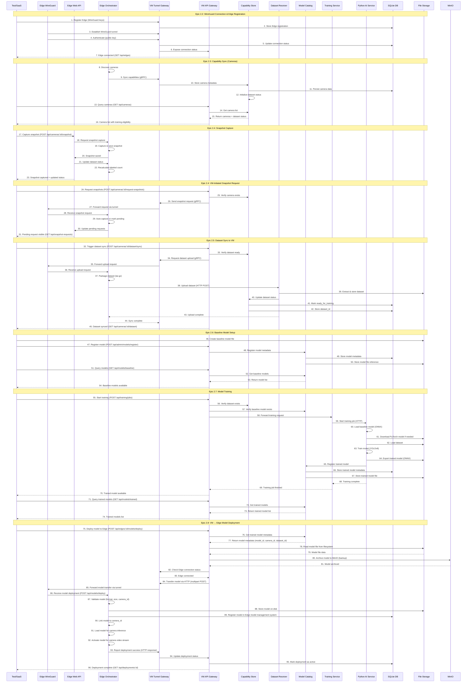

# Phase 2 Flow Diagram - Tested in Local Dev Environment

This document provides a visual flow diagram of Phase 2 components and workflows that have been tested in the local development environment.

## Overview

Phase 2 focuses on **User VM API Services** that handle:
- Secure Edge ↔ VM connectivity (WireGuard)
- Dataset collection and management
- Model training pipeline
- Model distribution to Edge

**Tested Epics**: 2.2, 2.3, 2.4, 2.5, 2.6, 2.7

**Planned Epic**: 2.8 (VM → Edge Trained Model Sync & Deployment)

## Phase 2 Sequence Diagram

This sequence diagram shows the temporal flow of interactions between components across Phase 2 epics.



## Complete Phase 2 Flow (Tested)

```mermaid
flowchart TB
    subgraph SaaS["SaaS Control Plane (Simulated)"]
        SaaSJob["SaaS Registration Job<br/>• Generate WireGuard keys<br/>• Register Edge in VM<br/>• Pre-configure Edge identity"]
    end
    
    subgraph VM["User VM API Services"]
        APIGateway["API Gateway<br/>HTTP REST API"]
        TunnelGateway["Tunnel Gateway<br/>• WireGuard server<br/>• Edge authentication<br/>• Connection monitoring"]
        CapabilityStore["Capability Store<br/>• Camera metadata<br/>• Dataset status tracking<br/>• Training eligibility"]
        DatasetReceiver["Dataset Receiver<br/>• Receive dataset uploads<br/>• Extract snapshots<br/>• Store in filesystem"]
        ModelCatalog["Model Catalog<br/>• Model registration<br/>• Model versioning<br/>• Model query"]
        ModelStorage["Model Storage<br/>• Model file storage<br/>• Metadata management"]
        TrainingService["Training Service Proxy<br/>Routes to Python AI Service"]
    end
    
    subgraph PythonAI["Python AI Service (Training)"]
        TrainingAPI["Training API<br/>• Start training jobs<br/>• Monitor training status<br/>• Model export"]
        ModelLoader["Model Loader<br/>• Load baseline models<br/>• Download PyTorch models<br/>• Configure for training"]
        Trainer["YOLOv8 Trainer<br/>• Fine-tune models<br/>• Export to ONNX"]
        DatasetLoader["Dataset Loader<br/>• Load datasets<br/>• Prepare YOLO format"]
    end
    
    subgraph Edge["Edge Appliance"]
        EdgeOrchestrator["Edge Orchestrator<br/>• Camera discovery<br/>• Snapshot capture<br/>• Dataset packaging<br/>• Model management<br/>• Camera-model linking"]
        EdgeAPI["Edge Web API<br/>• Camera management<br/>• Snapshot capture<br/>• Pending requests<br/>• Model deployment"]
        EdgeWG["WireGuard Client<br/>• Tunnel establishment<br/>• gRPC communication"]
        EdgeModelMgr["Edge Model Manager<br/>• Model storage<br/>• Model registry<br/>• Camera-model mapping"]
    end
    
    subgraph Storage["Storage Services"]
        SQLite[("SQLite Database<br/>• Edge registry<br/>• Camera metadata<br/>• Dataset metadata<br/>• Model catalog")]
        MinIO[("MinIO Storage<br/>• Model files<br/>• Dataset archives")]
        TrainingData[("Training Data<br/>• Datasets<br/>• Trained models<br/>• Training outputs")]
    end
    
    %% SaaS Registration Flow
    SaaSJob -->|1. Register Edge| TunnelGateway
    SaaSJob -->|2. Generate Keys| EdgeWG
    
    %% Epic 2.2: WireGuard Connection & Edge Registration
    EdgeWG -->|3. Establish Tunnel| TunnelGateway
    EdgeWG -->|4. Authenticate| TunnelGateway
    TunnelGateway -->|5. Register Edge| SQLite
    TunnelGateway -->|6. Monitor Connection| APIGateway
    
    %% Epic 2.3: Capability Sync
    EdgeOrchestrator -->|7. Sync Capabilities| TunnelGateway
    TunnelGateway -->|8. Store Camera Metadata| CapabilityStore
    CapabilityStore -->|9. Update Database| SQLite
    APIGateway -->|10. Expose Cameras| CapabilityStore
    
    %% Epic 2.4: Snapshot Capture
    EdgeAPI -->|11. Capture Snapshot| EdgeOrchestrator
    EdgeOrchestrator -->|12. Save Snapshot| EdgeAPI
    EdgeAPI -->|13. Update Dataset Status| EdgeOrchestrator
    APIGateway -->|14. Request Snapshots| EdgeWG
    EdgeWG -->|15. Receive Request| EdgeOrchestrator
    EdgeOrchestrator -->|16. Auto-capture or<br/>Show Pending| EdgeAPI
    
    %% Epic 2.5: Dataset Sync
    EdgeOrchestrator -->|17. Package Dataset| EdgeWG
    EdgeWG -->|18. Upload Dataset| DatasetReceiver
    DatasetReceiver -->|19. Extract & Store| TrainingData
    DatasetReceiver -->|20. Update Status| CapabilityStore
    CapabilityStore -->|21. Mark Ready for Training| SQLite
    
    %% Epic 2.6: Baseline Model Setup
    ModelStorage -->|22. Store Baseline Model| TrainingData
    ModelCatalog -->|23. Register Model| SQLite
    APIGateway -->|24. Expose Models| ModelCatalog
    
    %% Epic 2.7: Model Training
    APIGateway -->|25. Start Training Job| TrainingService
    TrainingService -->|26. Forward Request| TrainingAPI
    TrainingAPI -->|27. Load Baseline Model| ModelLoader
    ModelLoader -->|28. Download PyTorch| TrainingData
    TrainingAPI -->|29. Load Dataset| DatasetLoader
    DatasetLoader -->|30. Read Dataset| TrainingData
    TrainingAPI -->|31. Train Model| Trainer
    Trainer -->|32. Export ONNX| TrainingData
    TrainingAPI -->|33. Register Trained Model| ModelCatalog
    ModelCatalog -->|34. Store Model| ModelStorage
    ModelStorage -->|35. Save to Training Output| TrainingData
    
    %% Epic 2.8: Model Deployment to Edge
    APIGateway -->|36. Deploy Model| ModelCatalog
    ModelCatalog -->|37. Get Model Metadata| ModelStorage
    ModelStorage -->|38. Read Model File| TrainingData
    ModelStorage -->|39. Archive to MinIO| MinIO
    APIGateway -->|40. Check Connection| TunnelGateway
    TunnelGateway -->|41. Transfer Model| EdgeWG
    EdgeWG -->|42. Receive Model| EdgeOrch
    EdgeOrch -->|43. Validate Model| EdgeOrch
    EdgeOrch -->|44. Store on Disk| EdgeModelMgr
    EdgeOrch -->|45. Register in DB| EdgeModelMgr
    EdgeModelMgr -->|46. Link to Camera| SQLite
    EdgeOrch -->|47. Load Model| EdgeModelMgr
    EdgeOrch -->|48. Activate for Camera| EdgeModelMgr
    EdgeOrch -->|49. Report Status| TunnelGateway
    TunnelGateway -->|50. Update Status| SQLite
    
    %% Styling
    classDef epic22 fill:#e1f5ff,stroke:#01579b,stroke-width:2px
    classDef epic23 fill:#f3e5f5,stroke:#4a148c,stroke-width:2px
    classDef epic24 fill:#e8f5e9,stroke:#1b5e20,stroke-width:2px
    classDef epic25 fill:#fff3e0,stroke:#e65100,stroke-width:2px
    classDef epic26 fill:#fce4ec,stroke:#880e4f,stroke-width:2px
    classDef epic27 fill:#e0f2f1,stroke:#004d40,stroke-width:2px
    
    class TunnelGateway,EdgeWG epic22
    class CapabilityStore,EdgeOrchestrator epic23
    class EdgeAPI,EdgeOrchestrator epic24
    class DatasetReceiver,TrainingData epic25
    class ModelCatalog,ModelStorage epic26
    class TrainingAPI,ModelLoader,Trainer,DatasetLoader epic27
    classDef epic28 fill:#fff9c4,stroke:#f57f17,stroke-width:2px
    
    class ModelCatalog,ModelStorage,MinIO,TunnelGateway,EdgeWG,EdgeOrch,EdgeModelMgr epic28
```



## Detailed Flow by Epic

### Epic 2.2: VM Edge Status Monitoring & WireGuard Connection Management

1. SaaS registration job generates WireGuard keys and registers Edge in VM database
2. Edge starts and establishes WireGuard tunnel to VM
3. Edge authenticates using WireGuard public key
4. VM validates Edge credentials and establishes connection
5. Connection monitoring tracks connection state (registered → connecting → connected)
6. Keepalive mechanism maintains tunnel health

### Epic 2.3: Post-WireGuard Edge ↔ VM Coordination

1. After WireGuard connection, Edge syncs capabilities (cameras) to VM
2. VM stores camera metadata in database
3. VM tracks dataset status per camera (labeled snapshot count, training eligibility)
4. VM exposes cameras via API with dataset status

### Epic 2.4: Snapshot Capture & Dataset Progress Fixes

1. User captures snapshots via Edge UI API
2. Edge saves snapshots with labels (normal/threat/abnormal/custom)
3. Edge updates dataset status in real-time
4. VM can request Edge to capture snapshots (auto_capture=true or false)
5. If auto_capture=false, Edge shows pending request in UI

### Epic 2.5: Edge → VM Dataset Sync & Upload

1. Edge packages labeled snapshots into dataset archive (tar.gz)
2. Edge uploads dataset to VM via HTTP POST
3. VM receives and extracts dataset
4. VM stores dataset in filesystem: `/app/data/datasets/{edge_id}/{camera_id}/{dataset_id}/`
5. VM updates training eligibility status to "ready_for_training"
6. VM links dataset_id to camera in database

### Epic 2.6: VM-Side Model Management for Training Readiness

1. Baseline model setup script creates baseline YOLOv8n model
2. Model is registered via Admin API
3. Model catalog stores model metadata
4. Model storage stores model file
5. Models are exposed via API
6. Model catalog provides model selection for training

### Epic 2.7: Model Training Pipeline

1. VM verifies baseline model exists
2. VM finds dataset (from Epic 2.5)
3. VM starts training job via Training Service API
4. Training Service loads baseline model (downloads PyTorch if needed)
5. Training Service loads dataset from shared storage
6. Training Service trains model using YOLOv8
7. Training Service exports trained model to ONNX
8. Training Service registers trained model in catalog
9. Trained model is stored locally and available for deployment

### Epic 2.8: VM → Edge Trained Model Sync & Deployment

1. VM keeps trained model locally after training (stored at `/app/data/models/{trained_model_id}/model.onnx`)
2. **VM Model Storage**: VM stores trained model in both:
   - **Model Management System**: Model registered in catalog with metadata (model_id, camera_id, dataset_id, version)
   - **MinIO Storage**: Model archived to MinIO S3-compatible storage (`models/{model_id}/model.onnx`) for long-term persistence and backup
3. VM receives deployment request for a trained model to a specific Edge/camera
4. VM verifies Edge is connected via WireGuard tunnel
5. VM validates model format and size (ONNX, ≤50MB for Edge)
6. VM reads trained model from MinIO (trained models are in MinIO only, not on disk)
7. VM transfers model to Edge via HTTP multipart POST over WireGuard tunnel
8. Edge receives model deployment at `POST /api/models/deploy` endpoint
9. Edge validates model (format, size, camera_id exists)
10. **Edge Model Storage**: Edge stores model:
    - **On Disk**: `/var/lib/view-guard-edge/models/{model_id}/model.onnx` and `metadata.json`
    - **In Model Management System**: Registered in Edge's SQLite database (`deployed_models` table)
11. Edge links model to specific camera ID for camera-specific inference
12. Edge loads model into memory and prepares it for the target camera
13. Edge configures preprocessing parameters from model metadata (input shape, normalization, etc.)
14. Edge activates model for real-time inference on that camera's video stream
15. Edge reports deployment status back to VM (deployed, active, or failed)
16. VM updates deployment status in database and exposes via API

## Data Flow Summary

### 1. Edge Registration & Connection
```
SaaS Job → VM (Register Edge) → Edge (Connect) → VM (Authenticate) → Connected
```

### 2. Camera Discovery & Sync
```
Edge (Discover Cameras) → Edge (Sync Capabilities) → VM (Store Metadata) → VM API (Expose Cameras)
```

### 3. Snapshot Collection
```
User/Test → Edge API (Capture) → Edge (Save) → Edge (Update Status) → VM (Request if needed)
```

### 4. Dataset Preparation
```
Edge (Package Dataset) → Edge (Upload) → VM (Receive) → VM (Extract) → VM (Store) → Ready for Training
```

### 5. Model Training
```
VM (Start Training) → Training Service (Load Model) → Training Service (Load Dataset) → 
Training Service (Train) → Training Service (Export) → VM (Register Model) → Model Available
```

### 6. Model Deployment to Edge
```
VM (Deploy Request) → VM (Archive to MinIO) → VM (Verify Connection) → VM (Transfer Model) → 
Edge (Receive & Validate) → Edge (Store on Disk) → Edge (Register in DB) → Edge (Link to Camera) → 
Edge (Load Model) → Edge (Activate for Camera) → Edge (Report Status) → VM (Update Status)
```

## Component Interactions

### Edge ↔ VM Communication
- **WireGuard Tunnel**: Encrypted, authenticated connection
- **gRPC Services**: 
  - Telemetry (heartbeat, metrics)
  - Control (snapshot requests, model deployment)
  - Streaming (event clips, dataset uploads)
- **HTTP APIs**: 
  - Edge Web API (local admin interface)
  - VM API Gateway (REST endpoints)

### VM ↔ Training Service Communication
- **HTTP Proxy**: VM API Gateway proxies training requests to Python AI Service
- **Shared Storage**: Models and datasets shared via Docker volumes
- **Model Catalog API**: Training service queries model metadata

### Storage Architecture
- **SQLite**: Metadata, configuration, state
- **MinIO**: Model files, dataset archives (S3-compatible)
- **Filesystem**: 
  - Datasets: `/app/data/datasets/{edge_id}/{camera_id}/{dataset_id}/`
  - Models: `/app/data/models/{model_id}/`
  - Training: `/app/data/training/{job_id}/`

## Key Technical Decisions

1. **Model Storage**: Baseline models stored in read-only shared volume, trained models in writable training output directory
2. **PyTorch Download**: Training service automatically downloads PyTorch models when ONNX models are present (required for training)
3. **Dataset Path**: Datasets stored at `/app/data/datasets/{edge_id}/{camera_id}/{dataset_id}/` for organization
4. **Volume Sharing**: Models and datasets shared between `user-vm-api` and `python-ai-service` via Docker volumes
5. **API Design**: REST APIs for external access, gRPC for Edge ↔ VM communication

---

*Last Updated: 2025-12-12*
*For detailed implementation plans, see: IMPLEMENTATION_PLAN_PHASE2.md*
