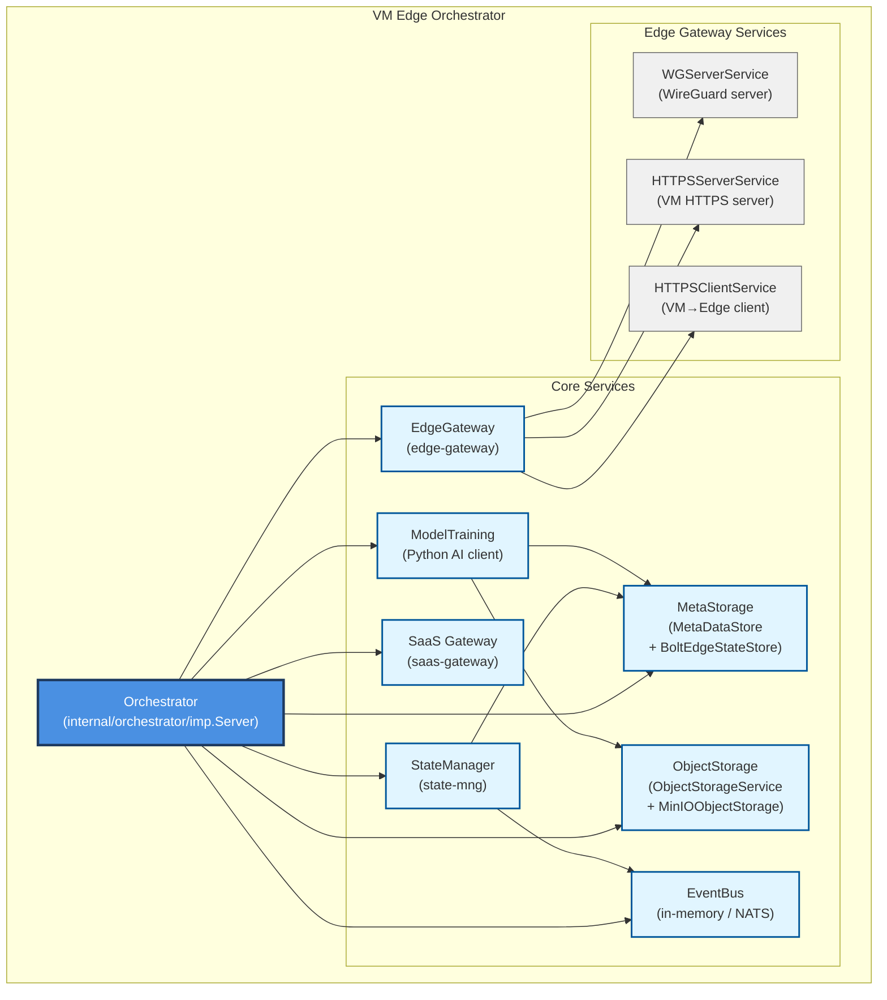

# VM Components Block Diagram

This document describes the high-level component structure of the **VM Edge Orchestrator** in `vm-edge-orch/internal`. It focuses on the main services and how they relate to each other, not on detailed data flow.

## Component Structure

## Component Descriptions

### Orchestrator (`internal/orchestrator/imp.Server`)
- **Responsibility**: Top-level coordinator for all VM-internal services.
- **Tasks**:
  - Loads configuration (`config.Config`).
  - Constructs and starts core services (EventBus, MetaStorage, ObjectStorage, EdgeGateway, StateManager, SaaSGateway, ModelTraining).
  - Manages lifecycle (`Init`, `Start`, `Shutdown`).

### Core Services

- **MetaStorage (`internal/meta-storage`)**
  - Defines `MetaDataStore` interface and `EdgeState`, model, event, clip, and dataset metadata types.
  - Implemented by `bbolt-imp/BoltEdgeStateStore` using BoltDB in `Config.DataDir`.
  - Provides atomic `Register*/Get*/Update*` methods for edge and model metadata.

- **ObjectStorage (`internal/object-storage`)**
  - Defines `ObjectStorageService` interface for binary artifacts (raw/trained models, datasets, clips).
  - `MinIOObjectStorage` in `minio-imp` implements this via a pluggable `S3Client` (MinIO/S3).

- **EventBus (`internal/event-bus`)**
  - Defines `EventBus` interface and `Event`/`EventType`.
  - `inmemory` implementation for local pub/sub; `nats` package is a stub for a future NATS-backed bus.

- **StateManager (`internal/state-mng`)**
  - Listens to edge-related events from `EventBus`.
  - Updates `MetaDataStore` edge state and schedules follow-up tasks (e.g., trigger training, deployment).
  - Executes next-step tasks in goroutines based on `EdgeStatus` (connected, HTTPS connected, authenticated, IoT synced, etc.).

- **EdgeGateway (`internal/edge-gateway`)**
  - Composite service that owns all VM↔Edge connectivity:
    - `WGServerService` (WireGuard server configuration and peer management).
    - `HTTPSServerService` (VM-side HTTPS/HTTP2 server for Edge → VM calls, via WireGuard).
    - `HTTPSClientService` (VM-side HTTPS/HTTP2 client for VM → Edge requests over WireGuard).
  - Exposed via the `EdgeGateway` interface in `edge_gateway.go` and implemented in `edge-gateway/impl`.

- **SaaS Gateway (`internal/saas-gateway`)**
  - `SaaSGateway` interface + implementation in `saas-gateway/impl`.
  - HTTP server that exposes admin / control plane APIs for external SaaS components.

- **ModelTraining (`internal/model-training`)**
  - Abstraction around the Python AI training service (via HTTP client).
  - Handles starting training jobs, tracking status, and integrating with MetaStorage/ObjectStorage.
